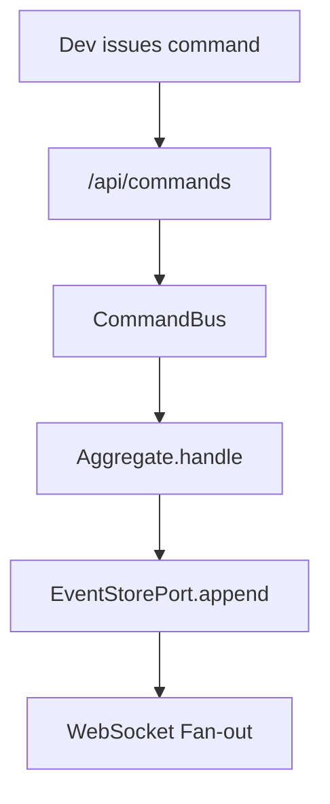
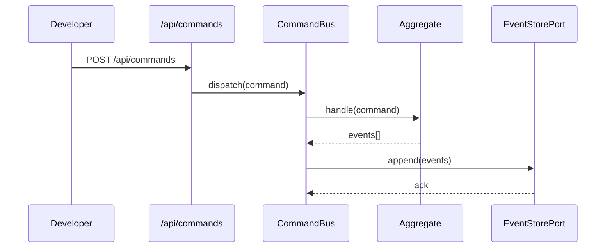

# ADR-000: Template

## What

Briefly state the decision being made. Keep it specific and outcome-oriented. Use a single sentence if possible.

## Why

Explain the problem or context that led to this decision. What pressures, constraints, or architectural goals make this the right time and place to introduce this pattern or change?

## How

Summarize how the decision will be implemented. Focus on concrete, high-level changes such as patterns adopted, APIs introduced, responsibilities reassigned, or boundaries enforced. Include code snippets or interface declarations when appropriate.

### Diagrams

#### Example Flowchart

#### Example Sequence Diagram

## Implications

| Category         | Positive Impact                                                  | Trade-offs / Considerations                                               |
| ---------------- | ---------------------------------------------------------------- | ------------------------------------------------------------------------- |
| Maintainability  | e.g., Domain code is cleaner and more modular                    | e.g., Requires migration or backfill for existing records                 |
| Extensibility    | e.g., New domains plug in with minimal boilerplate               | e.g., Developers must learn and adhere to new registration contract       |
| Operational      | e.g., Safe to run in CI or via CLI with full observability       | e.g., Requires environment variables or provider-specific configuration   |
| System Integrity | e.g., All interactions go through validated, deterministic ports | e.g., Any infra bypass will violate determinism unless guarded explicitly |

## Alternatives Considered

| Option   | Reason for Rejection                                                |
| -------- | ------------------------------------------------------------------- |
| Option A | Too rigid for growing slice count; difficult to enforce dynamically |
| Option B | Required hardcoded knowledge in infrastructure or brittle naming    |

## Result

Brief summary of what happens after this decision is applied. Is this already implemented? Pending? What becomes simpler, safer, or more traceable? Include any post-decision guidance or future-facing notes (e.g., “future ADRs may refine this registry further”).
