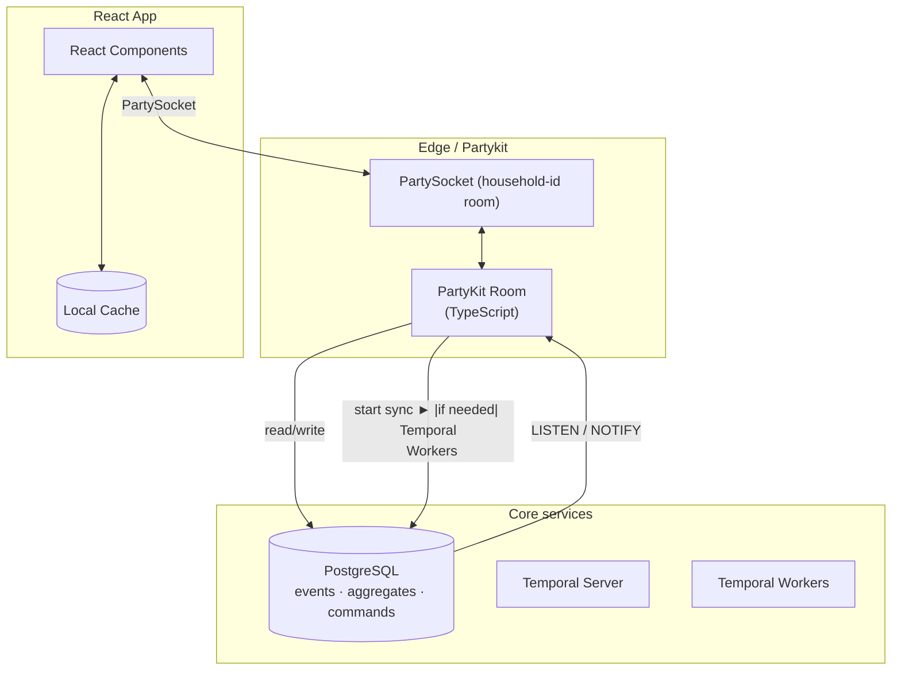

# ADR: Hexagonal Multi-Tenant Real-Time Platform (Partykit, Postgres, Temporal)

## 1. High-Level Architecture



### Tenant Isolation

* **Household ID:** `party.id` in Partykit; becomes `tenant_id` everywhere.
* **Postgres:** Every table includes `tenant_id` and RLS (row-level security) using `tenant_id = current_setting('app.tenant_id')`.
* **Temporal:** Workflow IDs prefixed with `tenant_id` for strict isolation.

---

## 2. Data Model

```sql
CREATE TABLE events (
  tenant_id      uuid   NOT NULL,
  id             uuid   PRIMARY KEY,
  aggregate_id   uuid   NOT NULL,
  type           text   NOT NULL,
  payload        jsonb  NOT NULL,
  version        int    NOT NULL,
  causation_id   uuid   NOT NULL,
  correlation_id uuid   NOT NULL,
  created_at     timestamptz DEFAULT now()
);

CREATE TABLE aggregates (
  tenant_id   uuid,
  id          uuid,
  type        text,
  snapshot    jsonb,
  version     int,
  PRIMARY KEY (tenant_id, id)
);

CREATE TABLE commands (
  tenant_id   uuid,
  id          uuid PRIMARY KEY,
  type        text,
  payload     jsonb,
  status      text,
  created_at  timestamptz DEFAULT now()
);
```

* **Tip:** Use Postgres 17+ with fail-over logical replication slots for reliable LISTEN/NOTIFY.

---

## 3. Domain Contracts

```ts
interface Command<T = any> { id: UUID; tenant: UUID; type: string; payload: T; metadata?: any; }
interface Event<T = any>   { id: UUID; tenant: UUID; type: string; payload: T; aggregateId: UUID; version: number; metadata?: any; }
```

* **Note:** `tenantId` is included in both `Command.metadata` and `Event.metadata`.

---

## 4. Hexagonal Ports & Adapters

### Ports (domain/interfaces)

```ts
export interface CommandPort  { dispatch(cmd: Command): Promise<void>; }
export interface EventPort    { on(evt: Event): Promise<void>; }
export interface EventStorePort  { append(e: Event[]): Promise<void>; load(t: UUID, a: UUID): Promise<Event[]>; }
export interface JobSchedulerPort{ schedule(cmd: Command): Promise<void>; }
export interface EventPublisherPort { publish(e: Event[]): Promise<void>; }
```

### Domain Service (core logic)

```ts
export class OrderService implements CommandPort, EventPort {
  constructor(
    private readonly store: EventStorePort,
    private readonly scheduler: JobSchedulerPort,
    private readonly publisher: EventPublisherPort
  ) {}
  async dispatch(cmd: Command) { /* hydrate, handle, persist, publish, schedule as needed */ }
  async on(evt: Event)         { /* hydrate, apply, persist, publish, schedule as needed */ }
  // ...hydrate(), persistAndPublish()...
}
```

### Example Adapters (infrastructure)

* **Partykit Command Adapter:** Receives and dispatches commands.
* **PgEventStore:** Appends/loads events for tenant+aggregate, triggers NOTIFY.
* **PgNotifyListener:** Forwards incoming events to the domain service.
* **TemporalScheduler:** Starts workflows for async jobs.
* **PartyPublisher:** Broadcasts events to WebSocket clients.

---

## 5. Example Workflow

**Write path (command):**

1. Client sends command → Partykit room.
2. Partykit adapter validates, persists to `commands` (status: pending).
3. If async: Temporal workflow started (workflowId: `${tenant}-${commandId}`).
4. If sync: Domain logic processes, emits events.
5. Events appended to `events`, trigger NOTIFY.
6. PgNotifyListener/adapters receive and rebroadcast.

**Read path (event sync):**

* Pg triggers NOTIFY on event insert.
* Adapters/Partykit room broadcast events to clients in the household room.
* Optional: snapshots cache latest state for late joiners.

---

## 6. Per-Tenant Bootstrapping

* Each Partykit room is keyed by `room.id = tenant_id`.
* On connect, a new domain service is constructed with tenant-specific adapters.
* Service listens for both inbound commands (from clients) and events (from NOTIFY).

---

## 7. Temporal Usage

Use Temporal workflows **only when needed**:

* External I/O (payments, inventory)
* Retries/timers (scheduled actions)
* Long-running processes

Worker pattern remains unchanged; Temporal only persists command status and appends follow-up events.

---

## 8. Hosting (Overview)

| Component       | Hosting recommendation                            |
| --------------- | ------------------------------------------------- |
| Partykit Edge   | Cloudflare Workers or local Docker (Miniflare)    |
| PostgreSQL      | Managed HA cluster (e.g., Fly.io, Aurora)         |
| Temporal Server | Managed or K8s Helm, DB schema can share Postgres |
| React Frontend  | Static hosting (Cloudflare Pages, S3, etc)        |

---

## 9. Why This Is Simple

* **One real-time layer:** Partykit for both commands and events—no separate in-memory game server.
* **Single persistence:** Postgres for all events/aggregates.
* **Declarative tenant isolation:** RLS and room.id everywhere.
* **Framework-agnostic core:** Hexagonal ports/adapters; pure domain logic.
* **Temporal optional:** Only for durable orchestration.

---

## TL;DR

* **Hexagonal core:** Domain logic is decoupled from frameworks, tested in isolation.
* **Adapters:** Infrastructure plugged in at boundaries.
* **Per-tenant state:** Each room builds and maintains in-memory projections keyed by tenant.
* **Low-latency sync:** LISTEN/NOTIFY, event sourcing, and real-time WebSocket.
* **Minimal moving parts, strong multi-tenancy, clear separation of concerns.**
