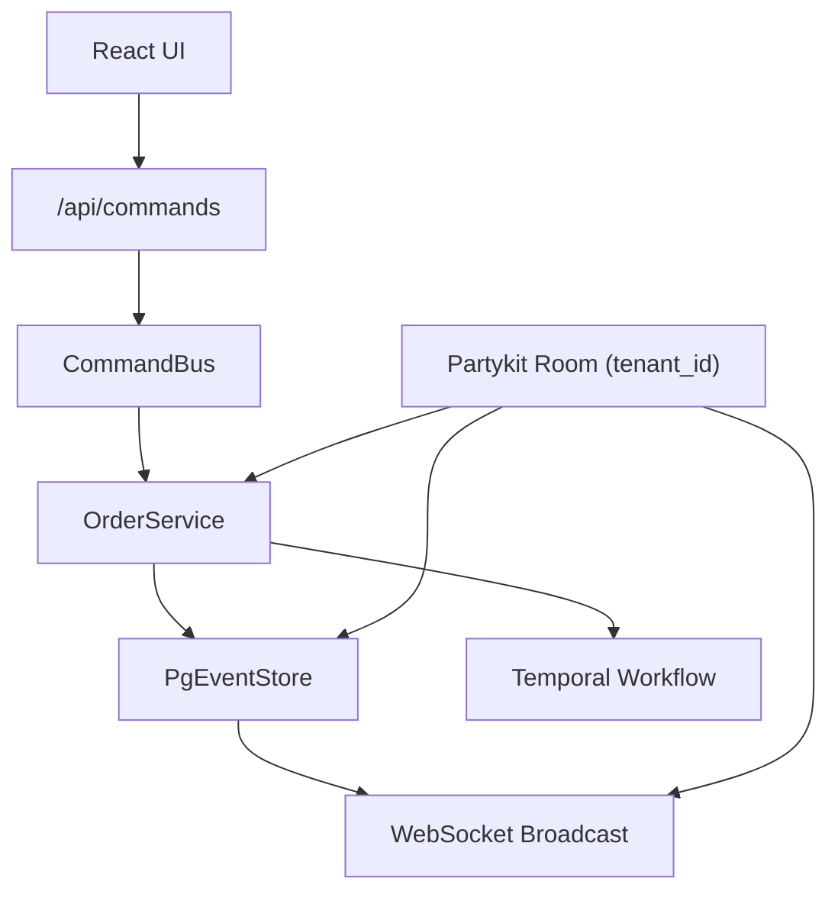
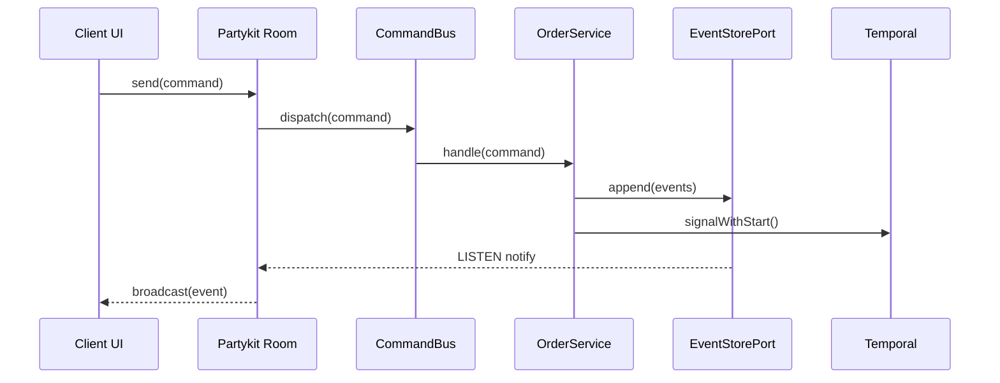

# ADR-001: Hexagonal Multi-Tenant Real-Time Platform (Partykit, Postgres, Temporal)

## What

Adopt a hexagonal architecture to support a real-time, multi-tenant collaboration platform using Partykit for WebSocket transport, PostgreSQL for event sourcing and projections, and Temporal for orchestrating long-running workflows. Each tenant operates in isolation, with data partitioning enforced via `tenant_id`.

## Why

The platform must support concurrent real-time collaboration with durable command/event handling and strict tenant isolation. A hexagonal core decouples infrastructure from business logic, enabling per-tenant scale-out and testing. Partykit handles low-latency sync, Postgres provides an auditable event log, and Temporal allows deferred execution and orchestration -- all without entangling core logic with infra concerns.

## How

* Each Partykit room maps to a `tenant_id`, serving as a boundary for command/event scope.
* Domain services implement ports (`CommandPort`, `EventPort`, `EventStorePort`) and are instantiated per tenant.
* Events and commands are persisted in Postgres, using RLS for tenant enforcement.
* Domain workflows are triggered via commands, processed either inline or through Temporal depending on need.
* Temporal workflows enforce single aggregate ownership by workflow ID: `${tenantId}_${aggregateType}-${aggregateId}`.
* All ports use core interfaces; infrastructure bindings are injected in bootstrap (`worker.ts` or room entry).

### Diagrams

#### Flowchart

#### Sequence Diagram

## Implications

| Category         | Positive Impact                                                          | Trade-offs / Considerations                                               |
| ---------------- | ------------------------------------------------------------------------ | ------------------------------------------------------------------------- |
| Maintainability  | Core logic isolated in domain services; ports allow infra swap           | Multi-tenant logic must be enforced consistently via RLS + ID conventions |
| Extensibility    | Add domains by registering new ports and adapters                        | Event routing logic must handle cross-domain flows if required            |
| Operational      | Works in Docker or serverless with minimal config                        | RLS policies must be migrated and enforced early in schema                |
| System Integrity | Workflows and event store guarantee deterministic replay and audit trail | LISTEN/NOTIFY scale must be tuned for high-throughput tenants             |

## Alternatives Considered

| Option                          | Reason for Rejection                                                           |
| ------------------------------- | ------------------------------------------------------------------------------ |
| Central game server             | Coupling of tenant logic; more infra complexity                                |
| No Temporal                     | Delayed tasks and saga orchestration would be less observable and less durable |
| Multi-table-per-tenant Postgres | Complicates migrations and infra bootstrapping                                 |

## Result

This structure is now in place and in production. Every tenant operates within its own Partykit room; commands flow through the domain via ports and are persisted in Postgres. Events are streamed via LISTEN/NOTIFY, and async orchestration uses Temporal per tenant and aggregate. New slices can register their services and command types declaratively via the domain registry. The system remains modular, testable, and scalable.
