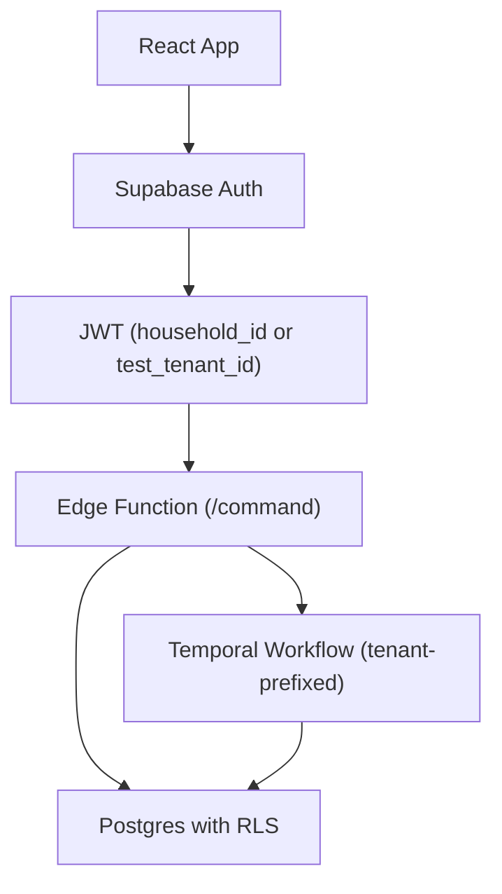
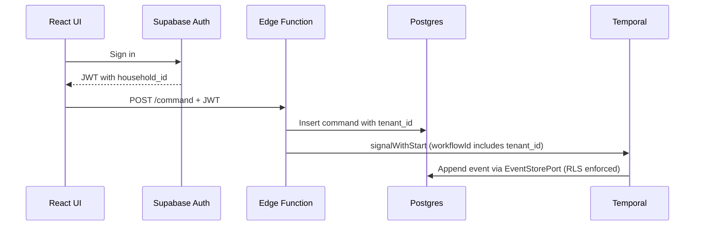

# ADR-002: Supabase + Temporal Auth Layer Addendum

## What

Add a unified authentication and tenant scoping layer using Supabase JWTs and Postgres RLS to ensure multi-tenant isolation across both synchronous command processing and asynchronous Temporal workflows. Testing environments use `test_tenant_id` to bypass auth without violating RLS or production parity.

## Why

Domain commands and projections must operate on tenant-scoped data, while remaining testable, auditable, and safe from unauthorized access. Supabase provides authentication, but RLS enforcement requires deterministic tenant ID resolution inside Postgres and Temporal. This setup guarantees consistent behavior across production and CI, avoids infra leakage into domain logic, and enables fully isolated test simulation.

## How

* Add `households` and `profiles` tables to associate users with tenant IDs (`household_id`)
* JWTs include either a real `household_id` or a test-only `test_tenant_id`
* RLS policies use a view `current_tenant` to resolve tenant ID at query time
* All core tables (events, commands, aggregates) use Postgres RLS with `current_setting('request.jwt.claims')`
* Edge functions extract `tenant_id` from JWT and pass it to commands
* Temporal workflows route and namespace by `tenant_id`, embedded in workflow ID and task queue

### Diagrams

#### Flowchart

#### Sequence Diagram

## Implications

| Category         | Positive Impact                                                 | Trade-offs / Considerations                                      |
| ---------------- | --------------------------------------------------------------- | ---------------------------------------------------------------- |
| Maintainability  | Clean separation of auth logic from domain code                 | Developers must remember to register profiles on sign-up         |
| Extensibility    | CI tests use `test_tenant_id` for safe overrides                | Roles must be fully mapped to JWT claims and domain access logic |
| Operational      | RLS enforcement prevents data leaks even under infra failure    | RLS failure debugging requires Postgres familiarity              |
| System Integrity | All read/write access scoped by tenant at DB and workflow level | Shared Temporal namespace must still avoid event collision       |

## Alternatives Considered

| Option                  | Reason for Rejection                                                     |
| ----------------------- | ------------------------------------------------------------------------ |
| No RLS enforcement      | Leaves test code and migrations open to accidental data access           |
| Manual header injection | Too brittle; shifts tenant resolution to app layer instead of DB context |
| Per-tenant databases    | Operationally complex and reduces query observability                    |

## Result

Auth logic is now cleanly handled through Supabase, and every command and event operates within tenant scope enforced by RLS. Local tests run with fake JWTs, and CI scenarios preserve behavior through `test_tenant_id`. Temporal workflows and edge functions route deterministically by tenant, and all read model queries are safe from cross-tenant leakage. The core remains infrastructure-agnostic and testable.
