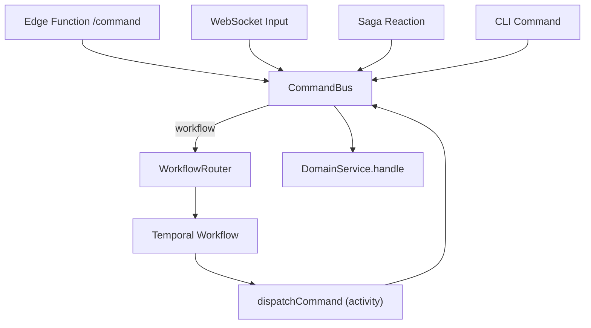
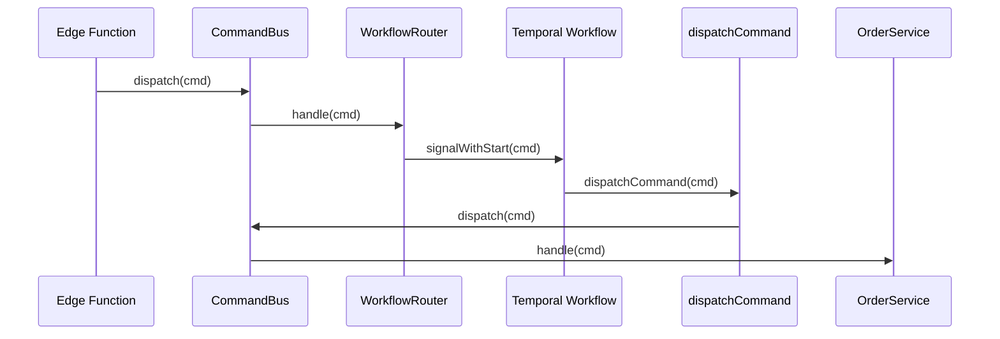

# ADR-004: Command Bus for Service Routing and Temporal Integration

## What

Introduce a centralized `CommandBus` to route all commands to the correct domain service (`CommandHandler`). The bus replaces ad-hoc routing logic and acts as the single interface for dispatching commands across all entry points (HTTP, WebSocket, Temporal, CLI). Temporal workflows also use the bus internally via a `dispatchCommand` activity, preserving deterministic domain execution.

## Why

Previously, command routing logic was scattered: Temporal workflows, sagas, and edge functions each needed custom knowledge of which service handled which command. This introduced duplication and risk of misrouting. A centralized bus abstracts routing logic, enforces command boundaries, and simplifies handler registration. It also supports future extensibility, observability, and validation tooling.

## How

* Define a `CommandHandler` interface with `supports()` and `handle()` methods.
* Domain services like `OrderService` implement `CommandHandler`:

  ```ts
  supports(cmd) => cmd.type.startsWith("order.")
  handle(cmd) => this.dispatch(cmd)
  ```
* `CommandBus` holds a list of registered handlers and dispatches the command to the first matching `supports()` handler.
* The `WorkflowRouter` implements `CommandHandler` and routes commands to Temporal workflows using `signalWithStart`.
* Inside the workflow, a `dispatchCommand()` activity uses the same `CommandBus` instance to call domain logic.
* All handlers are registered during system startup via `bus.register(...)`.

### Diagrams

#### Flowchart



#### Sequence Diagram



## Implications

| Category         | Positive Impact                                      | Trade-offs / Considerations                                   |
| ---------------- | ---------------------------------------------------- | ------------------------------------------------------------- |
| Maintainability  | Routing logic is isolated in one place               | Developers must implement `supports()` logic per handler      |
| Extensibility    | New domains/services register handlers declaratively | Runtime-only registry; requires startup discipline            |
| Operational      | Supports tracing and metrics at dispatch boundary    | Misrouting bugs may be harder to debug without handler labels |
| System Integrity | All command entry points use same resolution path    | Conflicts if multiple handlers support same command type      |

## Alternatives Considered

| Option                       | Reason for Rejection                                               |
| ---------------------------- | ------------------------------------------------------------------ |
| Static switch/case routing   | Unscalable with multiple domains                                   |
| Workflow-only routing        | Breaks separation of concerns; forces orchestration at entry point |
| DI container with decorators | Adds unnecessary complexity and inversion for current scale        |

## Result

All commands, regardless of origin, are dispatched through a central `CommandBus`. Domain services register themselves via `register(handler)`. Temporal workflows invoke `dispatchCommand()` activity, which reuses the same bus instance, ensuring parity and determinism. Adding a new domain requires only a new service that implements `CommandHandler` and is registered at startup -- no infra changes required.
