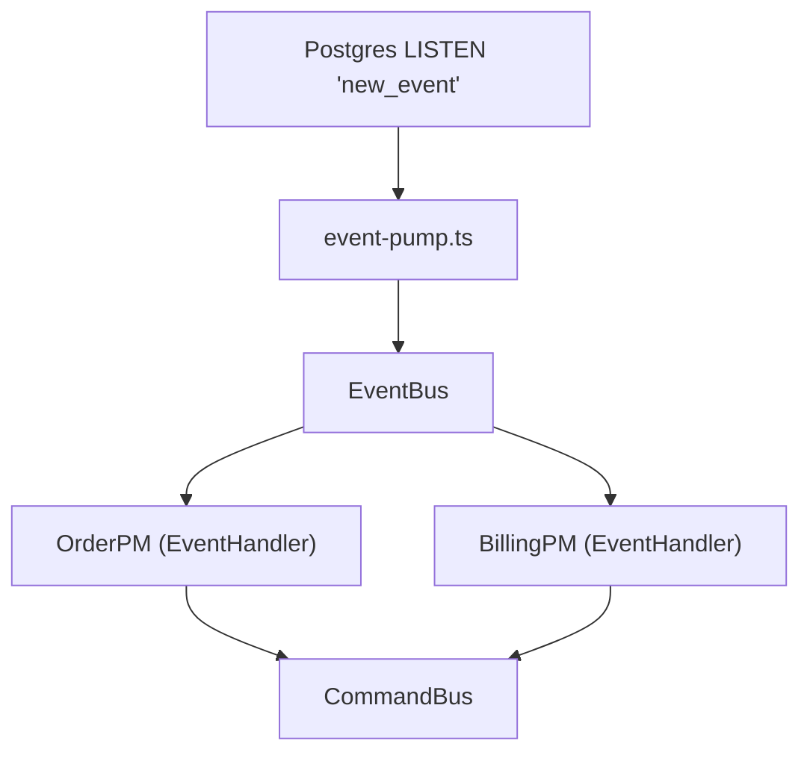
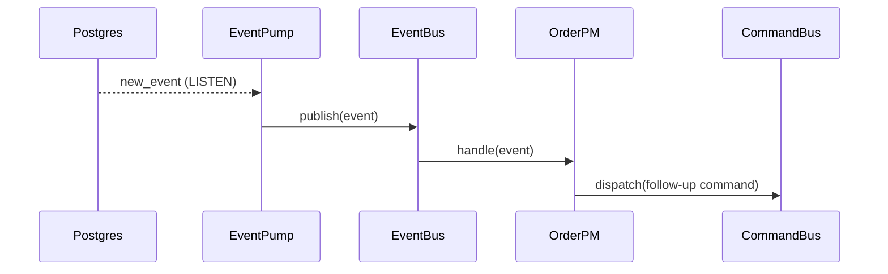

# ADR-005: Routing Events Through an Event Bus in the Worker

## What

Introduce a centralized `EventBus` in the worker to route persisted domain events to registered process managers (`EventHandler`s). Events are streamed from Postgres using LISTEN channels or realtime change feeds, and dispatched to handlers that match via `supports(event)` logic. Each handler is responsible for triggering follow-up commands or side effects using the existing `CommandBus`.

## Why

Previously, event-triggered logic (e.g., sagas, projections) relied on static imports and direct calls, breaking separation and limiting scale. A centralized event bus allows modular, pluggable handlers while preserving the core principle of event immutability and one-directional flow. It matches the `CommandBus` pattern for symmetry and enables testable, observable event reaction logic per domain.

## How

* Define an `EventHandler` interface with `supports()` and `handle()` methods.
* Register each handler using `eventBus.register(handler)`.
* Create a worker-side `RealtimePumpBase` that listens to the `events` table via Postgres `LISTEN` or Supabase Realtime.
* On each new event, the pump publishes it to `eventBus.publish()`, which dispatches to matching handlers.
* Each handler (e.g. `OrderPM`, `BillingPM`) reacts and uses the `CommandBus` to trigger further domain actions (e.g. retries, follow-ups).
* The pump runs in the same worker as command pump and other infra listeners.

### Diagrams

#### Flowchart

#### Sequence Diagram

## Implications

| Category         | Positive Impact                                                          | Trade-offs / Considerations                                           |
| ---------------- | ------------------------------------------------------------------------ | --------------------------------------------------------------------- |
| Maintainability  | Adds symmetry to command bus pattern                                     | Developers must manage handler registration explicitly                |
| Extensibility    | Easily add/remove process managers per event                             | Potential for event duplication if handler `supports()` isn’t precise |
| Operational      | Projections, sagas, and workflows can react independently                | Logging and tracing per handler should be added for observability     |
| System Integrity | Immutable event log remains the source of truth; no mutation by handlers | Handlers must remain idempotent and side-effect-safe                  |

## Alternatives Considered

| Option                 | Reason for Rejection                            |
| ---------------------- | ----------------------------------------------- |
| Static handler calls   | Coupled and unscalable; no runtime registration |
| Chained event reaction | Hard to trace and debug; poor testability       |
| Kafka-based fan-out    | Adds unnecessary infra for current use case     |

## Result

All domain events are now routed through a centralized worker-side `EventBus`. Process managers are registered explicitly and determine routing through `supports(event)`. Handlers issue commands via the existing `CommandBus`, preserving system determinism and enabling traceable, testable event reactions. The event pump pipeline becomes modular and consistent with command dispatch.
