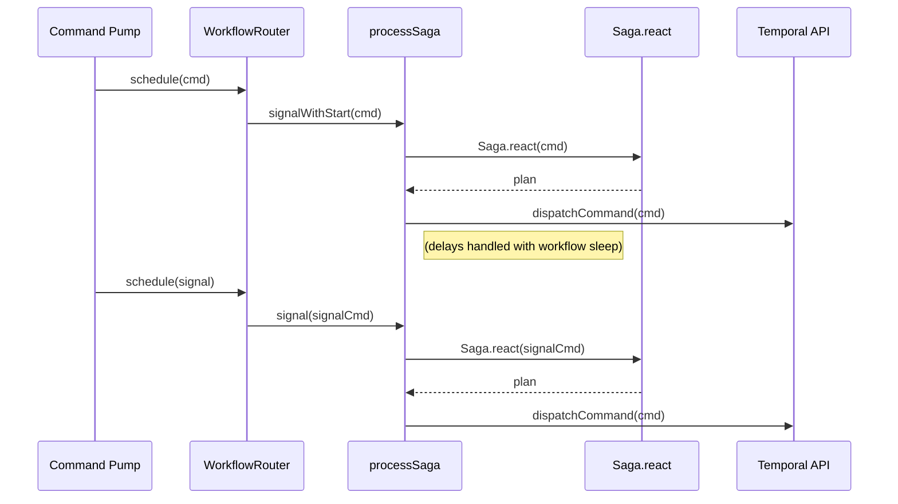

## 006- ADR: Temporal Saga Orchestration Using `signalWithStart` and Idempotent Execution Plans

### Context

The system requires long-lived, fault-tolerant workflows to orchestrate complex domain behaviors using event-command driven logic. Each workflow must:

- Support both initial and subsequent commands/events
- Handle signal-based updates without restarting
- Maintain deterministic replayability for Temporal
- Delegate orchestration logic to domain-level saga definitions
- Operate without tight coupling to Temporal-specific APIs within the domain core

A core invariant is the separation of orchestration (Temporal workflows) from business logic (saga plans and policies), ensuring testability, maintainability, and bounded-context clarity.

### Decision

The system will use Temporal’s `signalWithStart` API to initiate or update saga workflows, with the orchestration logic defined in a shared `processSaga` workflow. This workflow:

- Executes the initial plan derived from the first command
- Registers a signal handler for external commands or events
- Waits for and processes additional signals via the same workflow ID
- Delegates plan resolution to the domain's registered saga definitions
- Executes plans consisting of commands and optional delayed commands

Workflows will remain alive and resumable by design, and will not terminate unless explicitly ended via TTL or a business-defined completion condition.

### Implementation Details

#### Core Domain

- Each domain module defines a `Saga.react(input, ctx)` function
- The function receives commands or events and a context (e.g., `nextId`)
- Returns a pure `ProcessPlan` (commands and/or delayed commands)
- Does not depend on Temporal modules or workflow APIs

#### processSaga Workflow

- Starts via `signalWithStart(initialCommand)`
- Executes the corresponding domain plan
- Listens for signals via `externalCommandSignal`
- Uses `condition(() => executed)` to pause deterministically between executions
- Does not run indefinitely via `while (true)`; relies on TTL enforcement within business logic

#### WorkflowRouter

- Routes a given command to the correct saga using `SagaRegistry`
- Uses `signalWithStart(workflow, { args, signal, signalArgs })`
- Ensures tenant-scoped task queues and consistent workflow IDs

#### Command Deduplication

- Causation IDs and deterministic UUIDs are used
- Duplicate executions (e.g. due to signal retries or restarts) are idempotently ignored by command consumers

### Consequences

#### Advantages

- Deterministic workflow behavior compatible with Temporal replay model
- Supports incremental, event-driven orchestration through signals
- Core domain logic remains free of Temporal dependencies
- Pure domain sagas can be unit tested and reused in other orchestrators
- Avoids premature termination of long-running workflows

#### Trade-offs

- Requires developer discipline in TTL and termination enforcement inside domain logic
- Workflow cache consumption increases with long-lived workflows (handled via cache eviction)
- Signal delivery and execution ordering must be observed and debugged at the application layer
- Requires plan execution to be side-effect free and idempotent

### Sequence Diagram

### Next Steps

- Finalize all domain-level saga definitions and registration
- Enforce `causationId`-based deduplication in dispatch layer
- TTL enforcement logic to be implemented in domain sagas where required
- Review and isolate side-effecting logic in activities only

--- 

Let me know if you'd like this exported to Markdown, PDF, or linked to your repo.