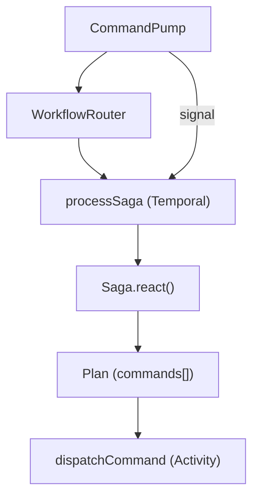
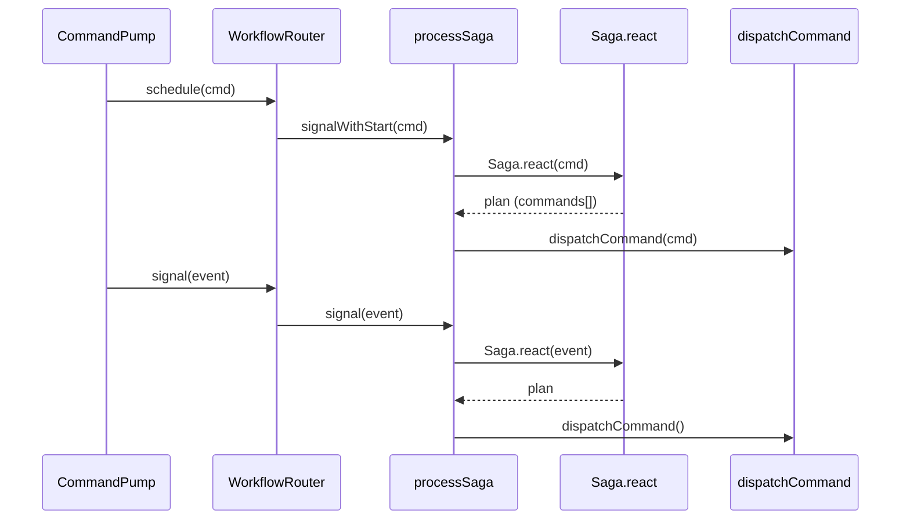

# ADR-006: Temporal Saga Orchestration Using `signalWithStart` and Idempotent Execution Plans

## What

Use Temporal’s `signalWithStart` API to orchestrate long-lived, event-driven saga workflows. All orchestration is performed inside a shared `processSaga` workflow per aggregate. The workflow executes an initial domain plan, listens for additional signals, and reacts via domain-defined `Saga.react()` functions. Plans return commands, which are dispatched through existing ports. Domain sagas remain Temporal-agnostic, and workflows enforce replay-safe, resumable, idempotent execution.

## Why

The system requires durable, multi-command workflows that can be extended reactively via events or sagas. These must support incremental planning, avoid restart-per-message overhead, and remain testable without depending on Temporal-specific APIs. `signalWithStart` ensures a single workflow instance per aggregate while supporting incremental signal-based updates. Domain logic stays pure and testable; only orchestration logic lives in workflows.

## How

* Each domain exports `Saga.react(eventOrCommand, context) => ProcessPlan`
* The `processSaga` workflow runs one saga instance per aggregate using a consistent `workflowId`
* On start:

    * The initial command triggers `Saga.react()` to get a plan
    * Each resulting command is dispatched via activity (`dispatchCommand`)
* Workflow listens for signals (`externalCommandSignal`)
* On signal:

    * Calls `Saga.react()` again
    * Executes next plan
* TTL logic ends the workflow after inactivity
* Plans must be idempotent; causationId and deterministic UUIDs used

### Diagrams

#### Flowchart

#### Sequence Diagram

## Implications

| Category         | Positive Impact                                                     | Trade-offs / Considerations                                           |
| ---------------- | ------------------------------------------------------------------- | --------------------------------------------------------------------- |
| Maintainability  | Domain sagas remain testable and free of Temporal logic             | Developers must chain up plans manually (no auto-termination)         |
| Extensibility    | New saga behavior is added by registering `Saga.react()` entries    | Each plan must be carefully written for idempotency and no side leaks |
| Operational      | Workflows are replay-safe, TTL-configurable, and restartable        | Workflow cache pressure increases with long-lived flows               |
| System Integrity | Commands are produced by domain logic, not hardcoded into workflows | Replay must ensure deterministic order and data availability          |

## Alternatives Considered

| Option                                   | Reason for Rejection                                            |
| ---------------------------------------- | --------------------------------------------------------------- |
| Workflow-per-command                     | Too heavy; breaks stream-level consistency                      |
| Embedding orchestration in workers       | Violates separation of concerns; hard to test                   |
| Upcasting commands/events into workflows | Introduces coupling between workflow logic and domain evolution |

## Result

Sagas are now orchestrated using long-lived `processSaga` workflows. Domain logic emits plans declaratively via `Saga.react()`. Temporal handles execution and replay, while activities ensure all domain mutations go through `CommandBus`. Signal-based extension allows workflows to grow and resolve over time, enforcing full replayability, modularity, and testability. The system gains durable, reactive orchestration with minimal infra coupling.
