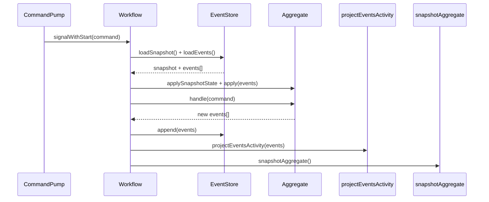

# ADR-007: Event-Sourced Aggregate Management with Temporal

## What

Manage aggregates using event sourcing and Temporal workflows. Each aggregate is owned by a single Temporal workflow, identified deterministically. Events are persisted through `EventStorePort`, aggregates apply state via `.apply(event)` and handle commands via `.handle(command)`. Snapshots are supported for optimization but not required. TTL logic allows workflows to exit cleanly after inactivity.

## Why

Aggregates must be consistent, replayable, and isolated per tenant and ID. Centralized workflows enforce single ownership. Event sourcing enables full historical trace, auditability, and state rehydration. Temporal adds durability and replay safety. Keeping domain logic pure while binding to infrastructure through ports enables isolated testing, clean rehydration, and safe state mutation across distributed systems.

## How

* Aggregate state is rebuilt via `EventStorePort.load()`, optionally starting from a snapshot.
* Each aggregate implements `.apply(event)` and `.handle(command)` methods.
* Temporal workflow `processCommand` handles:

  * Receiving command
  * Loading aggregate
  * Applying state from snapshot + events
  * Executing `.handle(command)` to emit new events
  * Appending events
  * Publishing events
  * Invoking projection and snapshot activities
* Workflows expire based on idle time (TTL), and a new one starts on the next command.

### Diagrams

## Implications

| Category         | Positive Impact                                           | Trade-offs / Considerations                                        |
| ---------------- | --------------------------------------------------------- | ------------------------------------------------------------------ |
| Maintainability  | Aggregates are isolated and testable via ports            | Developers must respect versioning and concurrency in append logic |
| Extensibility    | Snapshots, projections, and workflows are plug-in steps   | Must coordinate snapshot format changes carefully                  |
| Operational      | TTL-based lifecycle allows graceful shutdown and recovery | Replay costs grow if TTLs are too short or snapshots unavailable   |
| System Integrity | Commands and events are routed deterministically          | Event store must preserve strict ordering and version control      |

## Alternatives Considered

| Option                              | Reason for Rejection                                  |
| ----------------------------------- | ----------------------------------------------------- |
| Shared aggregate pools              | Too prone to race conditions                          |
| Aggregate-per-request (no workflow) | No stateful coordination, poor retry/resume semantics |
| Global event stream (no snapshot)   | Inefficient for long-lived aggregates                 |

## Result

Each aggregate is owned by a deterministic Temporal workflow. State is persisted via event sourcing and optimized with snapshots. Commands are processed deterministically and replay-safe, using isolated core logic and Temporal orchestration. Snapshots and TTL behavior keep workflows efficient and scalable while maintaining full audit and traceability guarantees.
