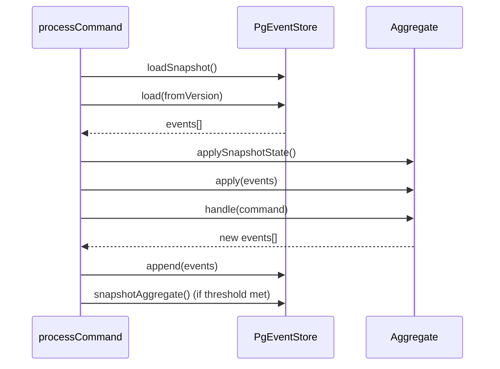

# ADR-008: Aggregate Snapshots

## What

Introduce periodic snapshotting for aggregates to reduce event replay time. A snapshot is stored every 2 successful `applyEvent()` executions and includes serialized aggregate state and version metadata. Snapshots are stored in the `aggregates` table and used to optimize state reconstruction during `loadAggregate`.

## Why

As event streams grow, rehydrating aggregates from scratch becomes inefficient. Storing snapshots allows aggregates to restore their state from a recent checkpoint and replay only newer events. Triggering snapshots after `applyEvent()` ensures that snapshots reflect real state transitions, not just command intent. This balances performance, determinism, and correctness.

## How

* Each aggregate implements `toSnapshot()` and `applySnapshotState()`
* `PgEventStore` includes a method `snapshotAggregate()` to persist a snapshot with:

  * `aggregate_id`, `tenant_id`, `type`, `version`, `snapshot`, `created_at`
* `load()` loads the latest snapshot (if present) and only replays events with version > snapshot.version
* In `processCommand`, an `appliesSinceLastSnapshot` counter is incremented after each event application; snapshot is taken after 2 applies

### Diagrams

## Implications

| Category         | Positive Impact                                                         | Trade-offs / Considerations                                     |
| ---------------- | ----------------------------------------------------------------------- | --------------------------------------------------------------- |
| Maintainability  | Aggregates remain small and testable with snapshots injected manually   | Requires snapshot version tracking if shape evolves             |
| Extensibility    | Snapshots are port-level; infrastructure can change without core impact | Core must expose stable serialization and hydration methods     |
| Operational      | Reduces replay time, improves workflow boot latency                     | Snapshots add minor storage and migration concerns              |
| System Integrity | Snapshots taken only after successful event application                 | Replaying from outdated snapshots is prevented by version guard |

## Alternatives Considered

| Option                         | Reason for Rejection                                     |
| ------------------------------ | -------------------------------------------------------- |
| Snapshot after `handle()`      | Unsafe—command may be invalid or rejected                |
| Snapshot every N commands      | May capture uncommitted or inconsistent state            |
| Snapshot via a synthetic event | Pollutes event stream with infrastructure-only artifacts |

## Result

Snapshotting is now supported via clean infrastructure APIs. Aggregates automatically snapshot every 2 `applyEvent()` calls. Snapshots are versioned and stored in `aggregates`, and rehydration is optimized without polluting the domain layer. Aggregate state remains pure and testable, and recovery speed improves without compromising consistency or determinism.
