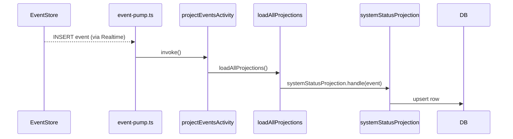

# ADR-012: Projection Layer — Modular, Slice-Owned, Temporal-Executed

## What

Move projection logic to live within its owning domain slice (`core/<slice>/read-models`) and execute all projection updates through Temporal activities. Projection handlers are dynamically loaded and use per-slice `ReadModelUpdaterPort` instances. This enforces vertical ownership, improves testability, and standardizes how projections respond to domain events.

## Why

Current projection logic is scattered, partly centralized, and partly static. This violates slice ownership and leads to brittle coupling between core and infrastructure. Running projections through Temporal activities enables retryability, observability, and decouples them from sync event processing. By colocating projection logic in the slice, we promote modularity, maintainability, and testability while enabling drift detection and RLS policy generation per projection.

## How

* Move each projection handler into `core/<slice>/read-models/`
* Each projection exports:

    * A projection handler implementing `EventHandler`
    * An array of expected column names (used for drift detection)
    * A `register*Projections(pool)` function to register all handlers
* Projections are executed via a Temporal activity `projectEventsActivity()`
* A loader discovers all projections at runtime (`loadAllProjections`)
* All read models live in Postgres and use per-slice migrations (via Umzug)
* Projection handlers are pure functions; write side-effects handled via `ReadModelUpdaterPort`

### Diagram

## Implications

| Category         | Positive Impact                                                      | Trade-offs / Considerations                                    |
| ---------------- | -------------------------------------------------------------------- | -------------------------------------------------------------- |
| Maintainability  | Projections live near the read models they affect                    | Slight overhead of setting up `register*Projections()`         |
| Extensibility    | New slices can register their own projections and migrations cleanly | Requires per-slice schema drift tooling and RLS awareness      |
| Operational      | Projections now run through retryable workflows                      | Must capture errors and logs in projection execution centrally |
| System Integrity | Full audit of projection writes, with clean domain ownership         | Misconfigured UpdaterPorts may lead to inconsistent writes     |

## Alternatives Considered

| Option                          | Reason for Rejection                                              |
| ------------------------------- | ----------------------------------------------------------------- |
| Centralized projection registry | Breaks slice modularity; doesn't scale well with domain growth    |
| Sync projection on event insert | Non-retryable, non-observable; breaks testability and portability |
| Projecting via CLI replay only  | Not viable for live event fan-out                                 |

## Result

All projection logic now lives inside the domain slice it reflects. Projections are retry-safe and executed asynchronously via Temporal activities. Each projection is registered via a loader and uses its own `ReadModelUpdaterPort`. Projections are now modular, testable, drift-detectable, and consistent with the system’s hexagonal architecture. This lays the foundation for enforcing RLS, validating schema drift, and safely evolving projections alongside domain events.
