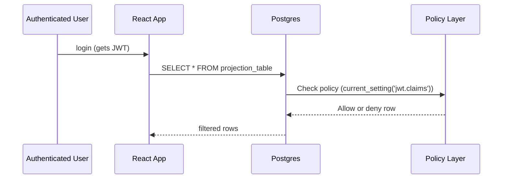

# ADR-013: Row-Level Security for Projections

## What

Introduce a policy-driven Row-Level Security (RLS) enforcement system for all Postgres-backed projections. Each domain slice defines its own read-model scopes, role grants, and SQL conditions. RLS policies are generated programmatically from this metadata and applied automatically during infrastructure setup and migrations.

## Why

Without enforced RLS, projections are vulnerable to cross-tenant data leakage or unauthorized access. Manually defining policies per table is brittle and error-prone. Declarative, slice-owned access policies improve visibility, testing, and enforcement of multi-tenant boundaries and role-based access. By colocating these definitions with read models, we ensure that access logic evolves with the model itself.

## How

* Each slice exports:

   * `ReadModelScopes`
   * `ScopeGrants` (role → scopes)
   * `ReadModelPolicies` (table, scope name, SQL condition, redaction logic)
* A tool (`generateRlsPolicies`) reads these files, builds SQL, and applies them using Umzug
* Policies are tracked in a dedicated RLS migration table
* Developers can use `--force-rls` to reapply all policies in CI or local boot
* `current_setting('request.jwt.claims')` is used to resolve user ID, tenant, and role
* Optional `redact()` functions allow row mutation before exposure (e.g. hiding private fields)

### Diagrams

## Implications

| Category         | Positive Impact                                                            | Trade-offs / Considerations                                            |
| ---------------- | -------------------------------------------------------------------------- | ---------------------------------------------------------------------- |
| Maintainability  | All access policies are defined and colocated with their projections       | Policy changes must trigger regeneration; SQL must remain version-safe |
| Extensibility    | New slices define and enforce their own access scopes                      | Table schema drift may cause policy misalignment                       |
| Operational      | RLS enforcement guarantees safety even under partial system failure        | Debugging access failures requires SQL inspection of RLS logic         |
| System Integrity | Prevents cross-tenant reads and enforces domain-specific role restrictions | JWT claims must be consistent and reliably parsed                      |

## Alternatives Considered

| Option                            | Reason for Rejection                                           |
| --------------------------------- | -------------------------------------------------------------- |
| Manual RLS per table              | Too brittle, unscalable across dozens of projections           |
| Full application-layer filtering  | Vulnerable to accidental leakage and bypass                    |
| Using Supabase's built-in tooling | Inflexible for Temporal + projection use case; not slice-aware |

## Result

All read models are now protected with declarative, testable RLS policies defined in their domain slices. Each policy maps a scope to a table and SQL condition and can optionally redact fields. Policies are generated automatically and enforced at the Postgres level. Multi-tenant data access is now auditable, enforced by default, and tied to domain logic—not infrastructure assumptions.
