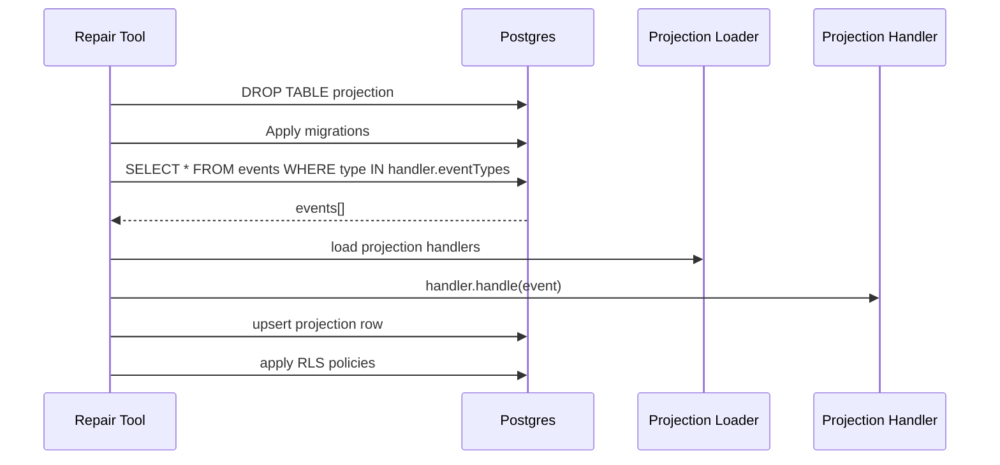

# ADR-015: Automated Projection Schema Drift Detection and Repair

## What

Introduce a repair workflow for projections exhibiting schema drift. When a projection table diverges from its handler’s declared schema, this tool automatically drops the table, reapplies slice-specific migrations, replays relevant events, and re-applies RLS policies. This enables zero-manual repair of broken projections using existing infrastructure and event logs.

## Why

Drift between a projection handler and its backing table -- due to refactors, partial migrations, or event evolution -- can cause silent failures. While detection tooling (ADR-014) surfaces drift, resolving it manually is error-prone. By automating repair with replay-based rebuilding, we make drift non-catastrophic and reduce time-to-recovery. It also reinforces event-sourced principles: state is ephemeral, events are canonical.

## How

* Each projection exports a `projectionMeta` with:

   * `table`: projection table name
   * `columnTypes`: declared shape
   * `eventTypes`: relevant domain events
* CLI tool `repair-projection-drift.ts`:

   * Loads all projection metas
   * Drops the projection table
   * Runs slice-specific migrations (via Umzug)
   * Extracts relevant events from `events` table using `eventTypes`
   * Replays each event using the registered projection handler
   * Re-applies any associated RLS policies

### Diagrams

## Implications

| Category         | Positive Impact                                                   | Trade-offs / Considerations                                        |
| ---------------- | ----------------------------------------------------------------- | ------------------------------------------------------------------ |
| Maintainability  | No manual intervention to fix schema mismatch                     | Drops the table; must ensure projections are truly stateless       |
| Extensibility    | Any domain with declared `projectionMeta` is eligible for repair  | Requires event log to be complete and up-to-date                   |
| Operational      | CI or devs can recover from projection corruption quickly         | Replay time may be slow for high-volume event domains              |
| System Integrity | Reinforces event-sourced principle: read models are derived state | Errors in upcasters or projection logic can still reintroduce bugs |

## Alternatives Considered

| Option                         | Reason for Rejection                                                      |
| ------------------------------ | ------------------------------------------------------------------------- |
| Manual migration repair        | Fragile, inconsistent, not scalable across slices                         |
| Partial update-in-place repair | Complex and brittle; hard to know which fields changed                    |
| Full delete-and-replay always  | Overkill if drift not present; separation between detect vs repair needed |

## Result

Projection repair is now automated via a CLI tool that drops, migrates, replays, and patches RLS for any drifted table. This gives developers confidence in evolving read models without breaking production flows. Repair is safe, stateless, and domain-isolated -- scalable across slices and aligned with the system’s event-sourced guarantees. Combined with ADR-014, this forms a complete detection-and-recovery pipeline.
