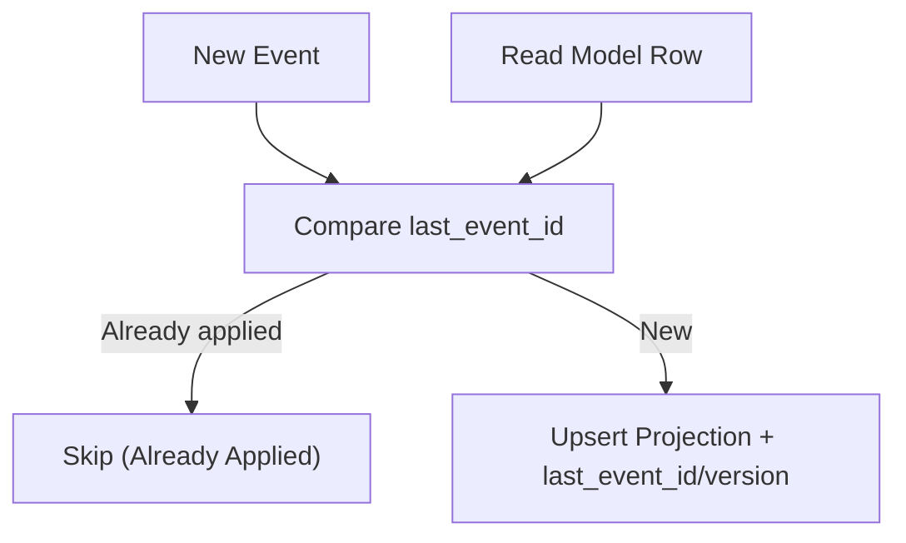
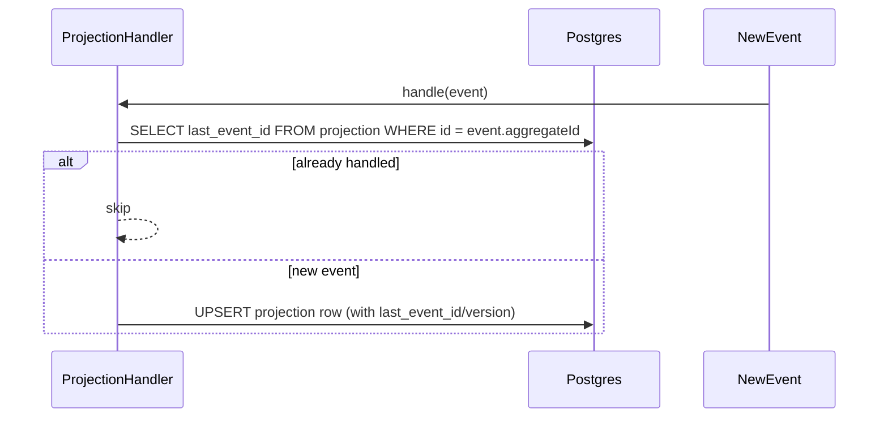

# ADR-016: Per-Projection Checkpointing via Embedded Last Event ID/Version

## What

Each projection row will now store its own checkpoint -- `last_event_id` and `last_event_version` -- as part of the projection payload. This embeds idempotency and recovery directly into the row structure, removing the need for global checkpoints or projection-wide offsets.

## Why

Projections need to be fault-tolerant and idempotent. Without a per-row checkpoint, it is difficult to resume a projection safely after failure or replay. Global checkpoints (e.g., per table or per stream) add unnecessary coordination. By storing the last event per row, we gain local recovery, retry safety, and a simple restart story -- critical for multi-tenant, high-cardinality domains.

## How

* Add `last_event_id` (UUID) and `last_event_version` (int) to each projection table
* Projection handlers must update these fields on every successful upsert
* Before applying an event, the handler can check the last checkpoint to decide whether to skip, update, or ignore
* Projection repair and replay tools rely on this field to avoid duplicating writes

### Diagrams

#### Flowchart

#### Sequence Diagram

## Implications

| Category         | Positive Impact                                                       | Trade-offs / Considerations                                 |
| ---------------- | --------------------------------------------------------------------- | ----------------------------------------------------------- |
| Maintainability  | No coordination across rows/tables; each row manages its own progress | Projection handlers must consistently include checkpointing |
| Extensibility    | Works across all domains and high-cardinality aggregates              | Snapshot/migration must preserve checkpoint fields          |
| Operational      | Replay-safe; reprocessing won’t overwrite correct state               | Some minor extra storage (2 fields per row)                 |
| System Integrity | Ensures at-most-once projection execution per row                     | Errors during write must not update `last_event_id`         |

## Alternatives Considered

| Option                        | Reason for Rejection                                    |
| ----------------------------- | ------------------------------------------------------- |
| Global projection checkpoints | Doesn’t scale per-tenant; race conditions possible      |
| No checkpointing              | Replay could duplicate or overwrite data inconsistently |

## Result

Projection logic now includes per-row checkpoints. This supports safe reprocessing, automated repairs, and idempotency. Each projection row tracks its last event ID and version, reducing the need for global coordination or complex reconciliation logic. Projection correctness becomes fully local, testable, and resilient.
