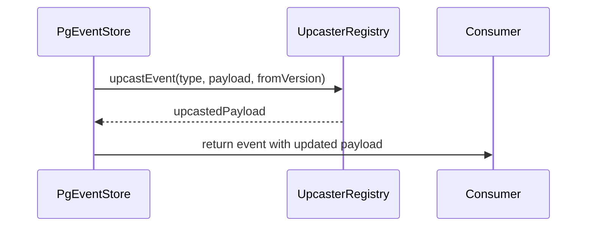

# ADR-017: Event Upcasting Strategy

## What

Introduce an upcasting system for domain events. Events are immutable, but their shape can evolve. Upcasting allows consumers to safely read old events using the latest schema by transforming payloads at load time, based on their `schemaVersion`.

## Why

Over time, domain models change -- new fields are added, renamed, or nested. Without upcasting, replaying old events would cause runtime errors or incorrect state. Instead of polluting aggregates with version-specific logic, we centralize schema transformation inside the persistence port, ensuring clean, deterministic, and forward-compatible event consumption.

## How

* Each event written includes `schemaVersion` in its `metadata`
* Upcasters are pure functions registered via `registerEventUpcaster(type, fromVersion, fn)`
* `PgEventStore.load()` applies `upcastEvent()` before returning events to consumers
* Only one version hop is applied at a time (v1 → v2), but multiple chained upcasters can be registered
* Upcasters are keyed by `eventType` and `fromVersion`; duplicate registration throws

### Diagram

## Implications

| Category         | Positive Impact                                               | Trade-offs / Considerations                                        |
| ---------------- | ------------------------------------------------------------- | ------------------------------------------------------------------ |
| Maintainability  | Aggregates stay schema-agnostic                               | Requires careful chaining of version transitions                   |
| Extensibility    | New fields can be added without breaking consumers            | Must validate old → new compatibility during tests                 |
| Operational      | Replay-safe; all events can be read without patching data     | Upcasting happens on every replay unless snapshotting is used      |
| System Integrity | Source-of-truth remains the raw event; logic is deterministic | Missing or incorrect upcasters can cause state divergence silently |

## Alternatives Considered

| Option                           | Reason for Rejection                                    |
| -------------------------------- | ------------------------------------------------------- |
| Store new events only            | Breaks backward compatibility for long-lived aggregates |
| Rewrite old events               | Violates immutability, brittle, high risk               |
| Apply version logic in aggregate | Violates separation of concerns, causes logic bloat     |

## Result

Event upcasting is now centralized and enforced via `PgEventStore`. Each domain event declares its version, and consumers always receive the latest shape. Upcasting logic is pure, testable, and enforced by registration. Aggregates and projections remain free of legacy schema handling, and replay becomes forward-compatible and safe. This supports long-term evolution of domain models without compromising determinism or testability.
