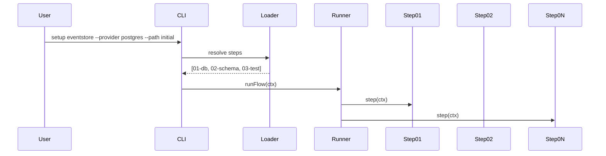

# ADR-018: Modular Infrastructure Setup CLI with Flow Engine & Provider Artifacts

## What

Introduce a unified CLI tool to bootstrap and evolve infrastructure slices like `eventstore`, `scheduler`, and `projections`. Each flow supports multiple paths (e.g., `initial`, `upgrade`) and multiple providers (e.g., `postgres`, `temporal`). Execution logic is organized as modular step files resolved from a `flow.yaml` descriptor. No logic is hardcoded—flows, paths, and providers are dynamically discovered.

## Why

Infrastructure initialization must be consistent, slice-modular, and extensible across technologies. Ad hoc scripts and one-off npm targets are brittle. This tool enables repeatable, testable setup flows across environments and makes it trivial to introduce new providers or adjust flow logic. It is usable interactively by developers and programmatically in CI.

## How

### 1. CLI Entry (`setup.ts`)

* Built with `commander`
* Global flags per flow:

    * `--provider <name>` (e.g., postgres)
    * `--path <name>` (e.g., initial, upgrade)
    * `--interactive` — prompts for missing flags
* Invalid or missing args without `--interactive` cause CLI to exit with code `1`

### 2. Flow Metadata (`flow.yaml`)

```yaml
defaultProvider: postgres
paths:
  initial:
    description: Fresh bootstrap of event store
    steps: [01-db, 02-schema, 03-test]
  upgrade:
    description: Apply migrations on existing store
    steps: [02-schema, 03-test]
```

### 3. Directory Structure

```
src/tools/setup/
├── setup.ts                   # CLI entry
├── flows/
│   ├── <flow>/                # e.g., eventstore
│   │   ├── flow.yaml
│   │   └── providers/
│   │       └── <provider>/
│   │           ├── steps/
│   │           │   ├── 01-db.ts
│   │           │   ├── 02-schema.ts
│   │           │   └── 03-test.ts
│   │           └── artifacts/
│   │               ├── migrations/
│   │               └── templates/
├── shared/
│   ├── logger.ts
│   ├── prompt.ts
│   ├── validation.ts
│   └── types.ts
└── tests/flows/
    └── <flow>/
        ├── initial.loader.spec.ts
        ├── initial.runner.spec.ts
        └── initial.integration.spec.ts
```

### 4. Flow Resolution

* `loader.ts`:

    * Reads `flow.yaml`
    * Selects provider/path from flags or interactively
    * Resolves ordered step files
* `runner.ts`:

    * Executes each step in sequence
    * Each step is an `async (ctx: FlowCtx) => void`
* Context includes:

  ```ts
  interface FlowCtx {
    vars: Record<string, unknown>;
    provider: string;
    pathName: string;
    artifactsDir: string;
    logger: Logger;
  }
  ```

### 5. Provider Isolation

* All logic and artifacts per provider live in `flows/<flow>/providers/<provider>/`
* Steps load resources relative to `ctx.artifactsDir`
* Adding a new provider (e.g., `mysql`) does not require edits to core CLI logic

### 6. Validation & Prompts

* All prompts use `prompts`
* All validation uses `zod`
* Config templates (e.g., `postgres.env_template`) are injected using env scaffolding logic

### Diagrams



## Implications

| Category         | Positive Impact                                                      | Trade-offs / Considerations                         |
| ---------------- | -------------------------------------------------------------------- | --------------------------------------------------- |
| Maintainability  | Flows and providers are fully modular and testable                   | Slight complexity in YAML + dynamic loading         |
| Extensibility    | Easy to add flows, providers, or alternate execution paths           | Requires conventions (step naming, artifacts path)  |
| Operational      | Works in local/dev/CI; flow logic is isolated and version-controlled | Migrations and templates must be strictly organized |
| System Integrity | All infra actions run through clean steps, typed input, and logging  | Partial step execution must be handled by callers   |

## Alternatives Considered

| Option                         | Reason for Rejection                               |
| ------------------------------ |----------------------------------------------------|
| Flat CLI commands with flags   | Too rigid; cannot modularize per flow/provider     |
| Make/Nx targets per infra task | Fragmented logic; no centralized prompt or testing |
| Scripts-per-provider (bash/ts) | Not easily testable, gets complex                  |

## Result

The infrastructure setup process is now declarative, modular, and extensible. Each domain (eventstore, scheduler, etc.) owns its own flow and provider logic. Steps are testable, traceable, and structured. The system supports interactive use, CI bootstrapping, and drop-in support for new database or scheduler targets without any central rewiring.
