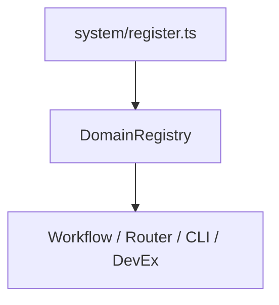
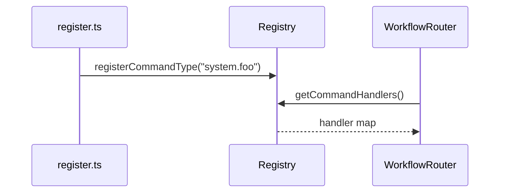

# ADR-020: Unified Core Domain Registry

## What

Introduce a central registry (`DomainRegistry`) for all core domain types -- aggregates, command handlers, event handlers, command/event types, sagas, and projections. Each domain self-registers by importing a `register.ts` file. This enables dynamic loading and tooling access without hardcoded lists scattered across the system.

## Why

As domains scale, wiring logic across workflows, routers, projections, and registries becomes brittle. Imports like `domains.ts` centralize too much, but still require manual intervention. By shifting to domain-local `register.ts` files and a shared `DomainRegistry`, we reduce duplication, improve discoverability, and allow other systems (like DevEx UI, CLI, or linters) to introspect the system programmatically.

## How

### 1. Add `registry.ts` in `src/core/`

```ts
export interface Registry {
  aggregates: Record<string, AggregateClass>;
  commandHandlers: Record<string, CommandHandler>;
  eventHandlers: Record<string, EventHandler>;
  sagas: Record<string, unknown>;
  commandTypes: Record<string, any>;
  eventTypes: Record<string, any>;
  projections: Record<string, EventHandler>;
  domains: string[];
}

// Registry singleton
const registry: Registry = { ... } // all maps initialized empty

// Registration functions (one per type)
export function registerCommandHandler(name: string, h: CommandHandler) { ... }
export function registerEventType(t: string, meta: any) { ... }
// ...

export const DomainRegistry = {
  aggregates: () => registry.aggregates,
  commandTypes: () => registry.commandTypes,
  // ...
};
```

### 2. Per-domain `register.ts`

Each slice (e.g. `system/`) defines:

```ts
export function registerSystemDomain() {
  registerDomain('system');
  registerAggregate('system', SystemAggregate);
  registerCommandHandler('system', new SystemCommandHandler());
  registerCommandType('system.executeTest', { domain: 'system' });
  registerEventType('system.testExecuted', { domain: 'system' });
}
registerSystemDomain(); // auto-executes
```

### 3. Loader file

```ts
// core/initialize.ts
import './system/register';
// future imports...

export function initializeCore() {
  console.info(`Domains: ${DomainRegistry.domains().join(', ')}`);
}
```

### 4. Consumers

* `CommandBus` uses `DomainRegistry.commandHandlers()`
* `WorkflowRouter` uses `DomainRegistry.sagas()`
* Projections loader uses `DomainRegistry.projections()`
* `/api/registry` exposes `GET /api/registry/commands?domain=xyz`

### Diagrams

#### Flowchart



#### Sequence Diagram



## Implications

| Category         | Positive Impact                                                           | Trade-offs / Considerations                               |
| ---------------- | ------------------------------------------------------------------------- | --------------------------------------------------------- |
| Maintainability  | Domain logic is owned per slice; adding types requires no global rewiring | Must ensure `register.ts` is imported exactly once        |
| Extensibility    | Dev tools, linters, and scaffolds can introspect types via registry       | Static code analysis requires consistent registry hygiene |
| Operational      | Enables new `/api/registry` routes for observability and tooling          | Duplicate registrations must throw to avoid silent issues |
| System Integrity | Registry serves as single source-of-truth for all domain capabilities     | Requires test coverage for registration completeness      |

## Alternatives Considered

| Option                     | Reason for Rejection                               |
|----------------------------|----------------------------------------------------|
| Central `domains.ts`       | Fragile; requires manual updates; not discoverable |
| Per-feature config loading | Too dynamic for typed, testable domain wiring      |
| Glob scans                 | Fragile & costly                                   |

## Result

All core domain types are now registered declaratively via `DomainRegistry`. Each domain owns its own registration contract. Infra code (bus, router, dev UI) loads handlers/types dynamically via introspection. Tooling can reason about domain boundaries programmatically. System is now safer to grow, trace, and analyze without risking desync between types and infrastructure.
