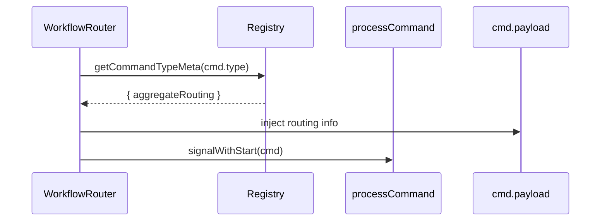

# ADR-021: Co-locate Aggregate Routing with Command Registration

## What

Extend `registerCommandType()` to include `aggregateRouting`, colocating routing logic with the command's metadata. This routing block includes the `aggregateType` and a function to extract `aggregateId` from the payload. It removes the need for implicit or runtime-derived routing behavior in workflows or sagas.

## Why

Previously, `aggregateType` and `aggregateId` were inferred at runtime -- often inconsistently -- across workflows, sagas, and command dispatchers. This caused drift between command intent and routing rules. By colocating routing inside the `commandTypes` registry, we make the behavior deterministic, statically visible, and enforceable by tooling.

## How

### 1. Command Type Metadata Update

Extend the registry schema:

```ts
export interface CommandTypeMeta {
  type: string;
  domain: string;
  description?: string;
  aggregateRouting?: {
    aggregateType: string;
    extractId: (payload: any) => UUID;
  };
}
```

### 2. Example Registration

```ts
registerCommandType(SystemCommandType.EXECUTE_TEST, {
  domain: 'system',
  description: 'Executes a system test',
  aggregateRouting: {
    aggregateType: 'system',
    extractId: (payload) => payload.testId,
  },
});
```

### 3. Workflow Dispatch Logic

Update `WorkflowRouter` (or equivalent):

```ts
const meta = DomainRegistry.commandTypes()[cmd.type];
const routing = meta?.aggregateRouting;

if (routing) {
  cmd.payload.aggregateType ??= routing.aggregateType;
  cmd.payload.aggregateId ??= routing.extractId(cmd.payload);
}
```

### 4. Linter Tooling (Optional)

Build a `lint-payloads.ts` tool that asserts:

* If `payloadSchema` is defined for a command, and
* If `aggregateRouting` is not defined, and
* The command is not explicitly marked as saga-only
  → then fail.

This ensures completeness and enforces registration discipline.

### Diagrams



## Implications

| Category         | Positive Impact                                                    | Trade-offs / Considerations                                    |
| ---------------- | ------------------------------------------------------------------ | -------------------------------------------------------------- |
| Maintainability  | Routing logic is colocated with command metadata                   | All new commands require upfront declaration                   |
| Extensibility    | Easy to inspect and lint; static inference for CLI / DevEx / Docs  | Some command payloads may require schema context to extract ID |
| Operational      | Ensures workflows receive proper routing state without duplication | Incorrect `extractId()` will silently misroute unless tested   |
| System Integrity | Prevents desync between workflows and commands                     | Test coverage for extractId functions is now critical          |

## Alternatives Considered

| Option                                 | Reason for Rejection                                               |
| -------------------------------------- | ------------------------------------------------------------------ |
| Infer aggregateId in workflows         | Leads to inconsistency and magic                                   |
| Require aggregateType in every payload | Burdens callers (especially from sagas); not idiomatic             |
| Central routing config                 | Adds indirection, less composable than colocating with the command |

## Result

Command routing is now statically defined and colocated with the command type itself. Workflows and sagas no longer need to inject routing logic manually. This improves clarity, reduces bugs, and enables tooling like linter checks and scaffolds to enforce coverage. Aggregate boundaries and command dispatch behavior are now deterministic and maintainable.
