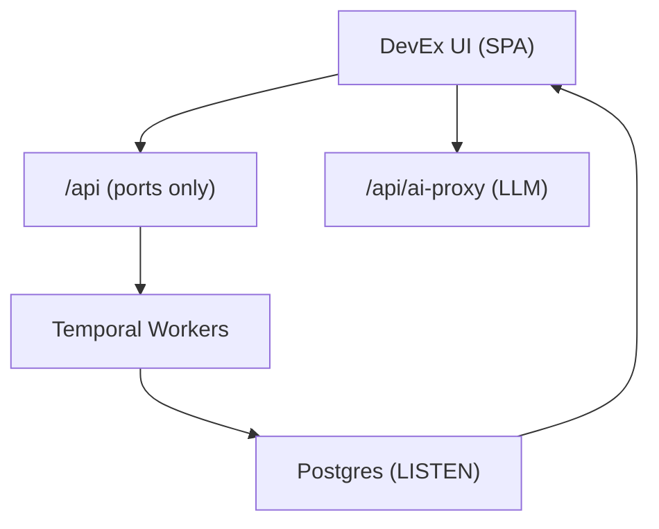
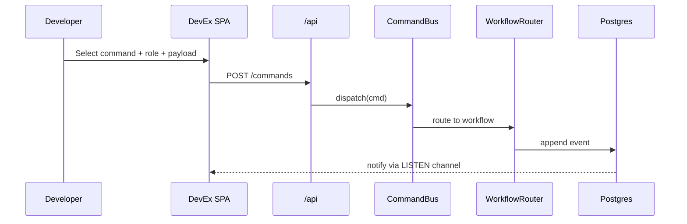

# ADR-022: Local Side-panel Dev-X Companion

## What

Introduce a local-first Developer Experience (DevEx) UI side-panel that integrates with the platform’s event-sourced architecture. It provides real-time inspection, replay, and scaffolding of commands, events, projections, and sagas -- backed by the same ports, workflows, and LISTEN channels used in production. The UI is context-aware, multi-tenant safe, and designed for offline use with optional AI scaffolding.

## Why

Prior to this, needed to rely on low-level tooling (psql, curl, Jaeger, Temporal Web) to understand and experiment with domain behavior. This was fragmented, error-prone, and lacked introspection. A unified DevEx panel brings observability, traceability, validation, and scaffolding into a single interface -- without violating domain boundaries or bypassing access control.

... and it's cool.

## How

### 1. Architecture Overview

* SPA frontend under `src/devex-ui/`
* `/api` routes backed by ports only (no direct DB access)
* AI scaffolding and simulation powered via `/api/ai-proxy`
* Uses `commandRegistry`, `eventRegistry`, `rolesStore`, etc. from `DomainRegistry`
* WebSocket or SSE stream listeners for commands/events from `LISTEN` channels

### 2. Features

| Tab             | Description                                                                              |
| --------------- | ---------------------------------------------------------------------------------------- |
| **Commands**    | Schema-driven forms, filtered by domain and role                                         |
| **Events**      | Real-time log of new events (via `LISTEN`) with filter/search                            |
| **Replay**      | Replays event chains through aggregates; shows what-if diffs                             |
| **Traces**      | Shows correlation-linked spans across workflows, projections, and retries                |
| **Projections** | Slice-specific projections (debug current state, schema drift, etc.)                     |
| **AI**          | Scaffold mode (command/saga generator), Chat mode (contextual code Q\&A), Simulator mode |

### 3. Command Flow

* UI loads command list from `/api/registry/commands?domain=xyz`
* Role list is dynamically populated from `rolesStore` (linked to domain)
* User selects role and payload; submits to `/api/commands`
* Backend calls `CommandBus.dispatch()`, same as prod
* Upon completion, correlated trace is shown in the UI

### 4. Security Model

* RLS enforced by default on remote Postgres if used
* No auth in local mode
* Role-based filtering on command schema (not client-enforced)

### Diagrams

#### Flowchart

#### Sequence Diagram

## Implications

| Category         | Positive Impact                                               | Trade-offs / Considerations                              |
| ---------------- | ------------------------------------------------------------- | -------------------------------------------------------- |
| Maintainability  | All registries and roles come from central DomainRegistry     | If registry is incomplete, UI features may fail silently |
| Extensibility    | Adding new command/event/saga auto-reflects in UI             | Must lint and validate role ↔ command coverage           |
| Operational      | UI usable offline or in CI/dev cluster                        | Shared DB across devs can cause noisy event streams      |
| System Integrity | All commands flow through production-safe ports and workflows | AI features generate `.patch` files only, never commit   |

## Alternatives Considered

| Option                   | Reason for Rejection                                          |
| ------------------------ | ------------------------------------------------------------- |
| Auto-committing AI patch | Unsafe; exploratory output should be manual-review only       |

## Result

The platform now includes a unified, local-first DevEx UI that exposes core domain capabilities in real-time. Developers can explore, emit, trace, replay, and scaffold commands and events through actual infrastructure paths. It aligns with the system’s principles -- multi-tenant safety, hexagonal architecture, and strict access control -- while unlocking powerful productivity and debugging capabilities for contributors.
