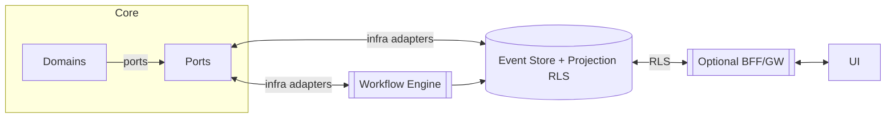
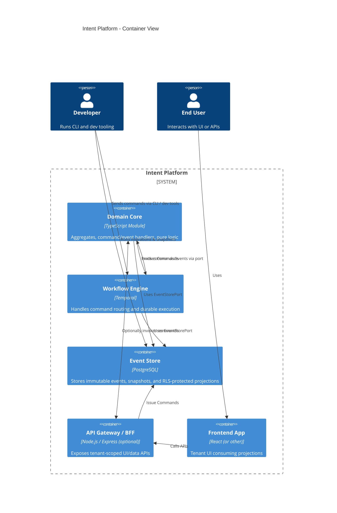

# Intent


[](https://github.com/geeewhy/intent/actions/workflows/build.yml)
[](https://github.com/geeewhy/intent/actions/workflows/unit-tests.yml)
[](https://github.com/geeewhy/intent/actions/workflows/core-linter.yml)
[](https://github.com/geeewhy/intent/actions/workflows/projection-linter.yml)
[](https://github.com/geeewhy/intent/actions/workflows/devx-ui-build.yml)

Actively maintained

> **Intent** turns event-sourcing theory into a platform you can demo in five minutes. It’s a pragmatic, ports-first reference for multi-tenant, event-sourced CQRS back-ends powered by TypeScript and uses [Temporal](https://github.com/temporalio/temporal) for durable workflow execution.

---

## Highlights

| Capability                                  | What it gives you                                                                                                                                                                                                                                                                                              |
|---------------------------------------------|----------------------------------------------------------------------------------------------------------------------------------------------------------------------------------------------------------------------------------------------------------------------------------------------------------------|
| **Lossless backend processing**             | Event-sourced core guarantees no data loss, even under retries, crashes, or partial failures. Structure follows DDD. Every command, event, and projection is persisted and replayable.<br/><sub>[Here's an explanation and following code](docs/architecture/event-sourcing.md)</sub>                          |
| **Ports-first hexagon**                     | Technology-agnostic core logic. Adapters for PostgreSQL (event store + RLS) and Temporal (workflows) plug in via explicit, testable ports.<br/><sub>[Read more on architecture reasoning](docs/reflections/index.md)</sub>                                                                                     |
| **Tenant isolation by default**             | Tenant IDs propagate edge → core → infra. Row isolation in DB and namespaced workflows prevent accidental cross-tenant access or leaks. <br/><sub>[See what, why and how it is implemented in Intent](docs/architecture/multi-tenancy.md)</sub>                                                                |
| **Self-healing infra bootstrap**            | Unified CLI flow runner sets up eventstore, scheduler, and projections interactively or in CI -- zero manual scripting, clear test feedback, and easily extendable for new providers.                                                                                                                          |
| **Built-in authorization**                  | Each projection declares access rules in metadata; they are compiled into Postgres RLS policies. CI linter blocks insecure access before it ships.                                                                                                                                                             |
| **Configurable, centralized observability** | Unified structured logging with context-aware `LoggerPort`, customizable log levels, and error serialization. OpenTelemetry spans wrap all key flows; logs and traces correlate via causation/correlation IDs. Logging behavior tunable via `.env` for local vs production.                                    |
| **Workflow-native execution**               | Commands and events are processed in durable Temporal workflows → supports back-pressure, retries, and exactly-once delivery at the source of truth.                                                                                                                                                           |
| **Full-circle event governance**            | Events flow from command → event → projection → saga with full traceability. Snapshot-aware loading and event upcasting support long-lived schemas and backward compatibility. See [ADR-017](ADRs/017-event-upcasting.md) and [ADR-010](ADRs/010-snapshot-upcasting.md) for snapshot implementation and upcasting rules. |
| **Projection drift protection**             | Tools detect schema drifts vs. history and auto-generate repair plans. Avoids full rebuilds, supports CI failure gating and controlled rewinds.                                                                                                                                                                |
| **Schema evolution support**                | Events are immutable, but projections and snapshots are versioned. Upcasters evolve event formats safely without breaking consumers.                                                                                                                                                                           |
| **Tooling for velocity**                    | Includes drift scanner, RLS linter, interactive setup runner, and a DevX-UI companion with event stream viewer and command issuer to ensure reproducibility and rapid local debugging. See [tools](src/tools/README.md) and [DevX](devex-ui/README.md)                                                         |

---

### Use cases and Scale

Current target scale: low thousands of TPS single-tenant backends. Open path to scale mid-thousands.

Current target use cases: high-fidelity, multi-tenant, event-sourced backends with complex business logic. Examples include AI orchestration, financial systems, manufacturing industries, async-heavy workflows, SaaS platforms, and high-complexity business domain applications.

### Why Intent?

Intent is a reference platform for event-sourced CQRS systems. Built from first principles to favor clarity, speed, and strong boundaries in multi-tenant TypeScript backends.

* **Reference Architecture:**
  Strict hexagonal boundaries, ports/adapters separation, and vertical slicing, [DCB](https://dcb.events/)-aligned. Every workflow and projection is testable, composable, and observable. Patterns align with the latest event modeling literature -- no magic, no leaks.

* **Built for Safety and Evolution:**
  Automated RLS policy generation, drift detection and repair, snapshotting, and schema upcasting are not afterthoughts -- they are part of the platform’s DNA. CI lints, policy gates, and repair tools keep safety guardrails up as you move fast.

* **Full-Stack Dev Experience:**
  The DevX companion UI, CLI flows, and local-first patterns make simulating, debugging, and evolving your event-sourced system immediate and visual. Real-time traceability, role simulation, and AI-assisted scaffolding let you reason about systems before they run in prod.

* **Multi-Tenant and Policy-First:**
  Tenant isolation and access policies are enforced from edge to core to database -- by design, not convention. Row-level security and role-based projection policies are automated and audited.

* **Transparent, Documented, and Extensible:**
  Every architectural decision is captured in living [ADRs](ADRs/). The codebase is structured for clarity, modification, and onboarding -- backed by docs and rationale, not just code comments.

### DevX-UI Demo

You can see the demo at https://intent.heart.dev

---

**Interested in taking Intent to production, collaborating, or supporting real-world use cases?**
Contact: **gy at heart dot dev**

---

## Prerequisites

| Tool | Minimum Version | Notes                                                                                         |
|------|-----------------|-----------------------------------------------------------------------------------------------|
| **Docker** | `24.x` | Engine + CLI; enables `docker compose` used by the Quick-start.                               |
| **Node.js** | `22.x` (current LTS) | TS/ESM project; lower versions are not tested.                                                |
| **Git** | any modern release | Needed to clone the repo.                                                                     |
| **Unix-like shell** | bash/zsh/fish | Commands assume a POSIX shell. Windows users can use WSL2 or Git Bash (untested; PRs welcome) |

## Quick-start (⏱ ~5 min)

```bash
git clone https://github.com/geeewhy/intent.git
cd intent
npm install
POSTGRES_DB=mydb HOST_POSTGRES_PORT=5432 docker-compose -p intentstack up --build 
npm run setup eventstore      # creates schemas, seeds initial RLS, generates .env
cp .env.local .env            # edit creds if needed
npm run dev:worker aggregates # starts the aggregates worker
npm run dev:worker sagas      # starts the sagas worker
````

### To run devx-ui

```
npm run api:admin
cd devx-ui
npm install
VITE_API_MODE=REAL VITE_API_URL=http://localhost:3001 npm run dev
```

<details>
  <summary>.env example</summary>

```env
# Database
LOCAL_DB_HOST=localhost
LOCAL_DB_USER=postgres
LOCAL_DB_PASSWORD=postgres
LOCAL_DB_NAME=intent

# Temporal
TEMPORAL_ADDRESS=localhost:7233

# App
PORT=3000
NODE_ENV=development
LOG_LEVEL=info
LOG_ERRORS_TO_STDERR=false

# Tenancy
TEST_TENANT_ID=0af03580-98d5-4884-96e4-e75168d8b887
ACTIVE_TENANTS=$TEST_TENANT_ID
```

</details>

---

## High-level Architecture





* You can find the full rationale in [docs/reflections](docs/reflections/index.md), 
* History of design decisions made in [ADRs](ADRs),
* and references to follow the code in [core/README](src/core/README.md) and [infra/README](src/infra/README.md).

---

## Scripts & Tasks

| Task                                           | Command                                                               |
|------------------------------------------------|-----------------------------------------------------------------------|
| Run aggregates worker                   | `npm run dev:worker aggregates`                                       |
| Run sagas worker                        | `npm run dev:worker sagas`                                            |
| Unit tests (pure domain)                       | `npm run test:core`                                                   |
| Integration tests (Postgres + Temporal)        | `npm run test:integration`                                            |
| Dev tools: setup, repair, drift-check, and more | View available DevEx tools at [tools/README.md](src/tools/README.md). |

---

## Project layout

See [docs/basics/project-structure.md](docs/basics/project-structure.md) for the full tree.

```
src/
  core/            ← aggregates, commands, events, ports
  infra/
    pg/            ← Postgres adapter
    temporal/      ← workflows + activities
    projections/   ← RLS helpers, Kysely/Slonik impls
  tools/           ← Tooling, setup & projection tooling, ...
docker/
  infra/compose.yaml  ← Postgres + Temporal services
```

## See Also

- [Architecture Overview](docs/reflections/index.md)  
  A guided walk through Intent’s hexagonal structure, CQRS patterns, and why it was built this way.
- [ADR Index](ADRs/)  
  All architectural decisions made explicit. Design rationale with no hand-waving.
- [DevX UI Docs](devex-ui/README.md)  
  Explore commands, projections, and traces in real time through the browser companion.
- [Tools Index](src/tools/README.md)  
  CLI and CI tooling for projection drift, RLS enforcement, and setup flows.
- [Roadmap](docs/next.md)  
  Upcoming features, enhancements, and goals for scaling Intent beyond the reference model.


---

## Contributing

1. Fork -> feature branch.
2. `npm run test:core` and `npm run test:integration` must pass.
3. Use conventional-commits (`feat:`, `fix:`).
4. PRs touching architecture must link an ADR.

---

Got questions or want to share what you're building with Intent?  
Use the [Discussions tab](https://github.com/geeewhy/intent/discussions).

---

## License

Open-sourced it early to align with the community and grow it in the open.

⚠️ Intent is not a product. It’s a developer-first reference implementation of modern event-sourcing patterns with a clear architectural spine. Hosted/cloud support, multi-backend support, and full admin UI are on the roadmap.

> Licensed under AGPL-3.0. Commercial licenses available. See [LICENSE](./LICENSE).
> Other open-source licenses are under consideration.
> By contributing, you agree to the [Contributor License Agreement](./CONTRIBUTOR_LICENSE_AGREEMENT.md).
