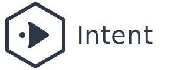
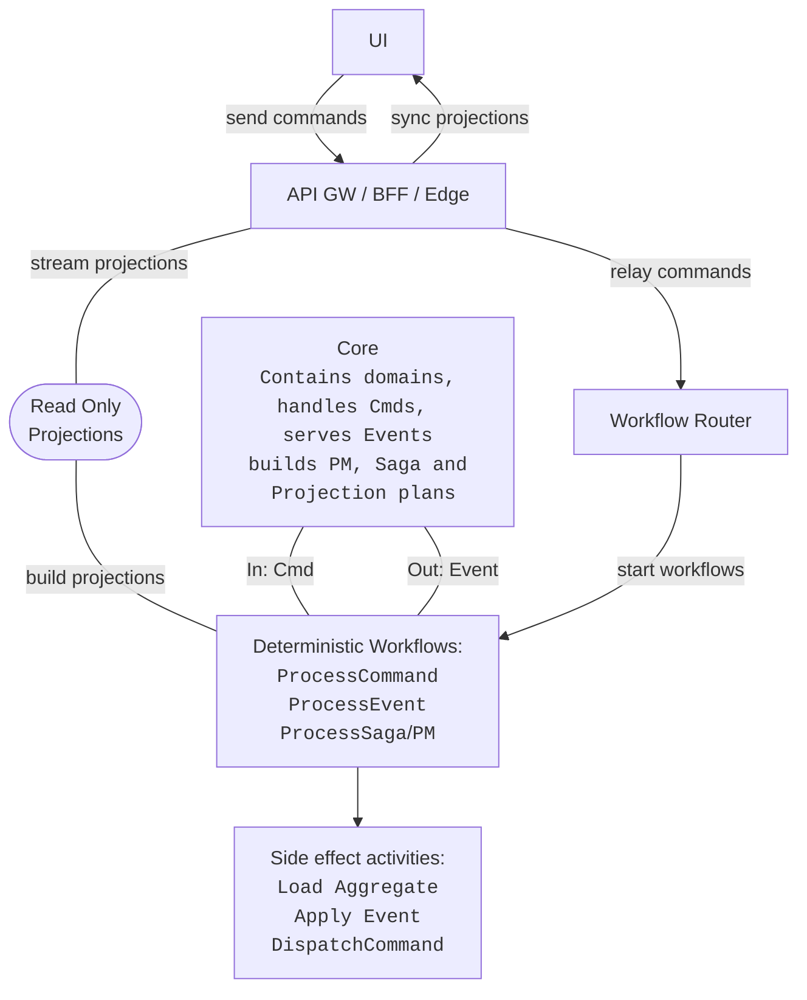
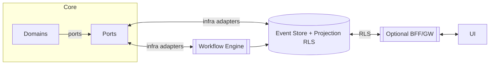
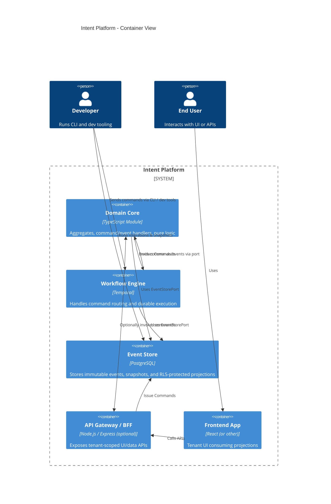

# Intent



[](https://github.com/geeewhy/intent/actions/workflows/build.yml)
[](https://github.com/geeewhy/intent/actions/workflows/unit-tests.yml)
[](https://github.com/geeewhy/intent/actions/workflows/projection-linter.yml)

> **Intent** turns event-sourcing theory into a platform you can demo in five minutes. It’s a pragmatic, ports-first reference for multi-tenant, event-sourced CQRS back-ends powered by TypeScript and Temporal for durable workflow execution.

---

## Highlights

| Capability                      | What it gives you                                                                                                                                                                                                                                                                                                             |
|--------------------------------|-------------------------------------------------------------------------------------------------------------------------------------------------------------------------------------------------------------------------------------------------------------------------------------------------------------------------------|
| **Lossless backend processing** | Event-sourced core guarantees no data loss, even under retries, crashes, or partial failures. Every command, event, and projection is persisted and replayable.                                                                                                                                                               |
| **Ports-first hexagon**         | Technology-agnostic core logic. Adapters for PostgreSQL (event store + RLS) and Temporal (workflows) plug in via explicit, testable ports. [What’s a hexagonal architecture?](https://en.wikipedia.org/wiki/Hexagonal_architecture_(software)).                                                                               |
| **Self-healing infra bootstrap** | Unified CLI flow runner sets up eventstore, scheduler, and projections interactively or in CI -- zero manual scripting, clear test feedback, and easily extendable for new providers.                                                                                                                                         |
| **Built-in authorization** | Each projection declares access rules in metadata; they are compiled into Postgres RLS policies. CI linter blocks insecure access before it ships.                                                                                                                                                                            |
| **Tenant isolation by default** | Tenant IDs propagate edge → core → infra. Row isolation in DB and namespaced workflows prevent accidental cross-tenant access or leaks.                                                                                                                                                                                       |
| **Production-grade observability** | Unified structured logging with context-aware `LoggerPort`, customizable log levels, and error serialization. OpenTelemetry spans wrap all key flows; logs and traces correlate via causation/correlation IDs. Logging behavior tunable via `.env` for local vs production.                                                   |
| **Workflow-native execution**   | Commands and events are processed in durable Temporal workflows → supports back-pressure, retries, and exactly-once delivery at the source of truth.                                                                                                                                                                          |
| **Full-circle event governance** | Events flow from command → event → projection → saga with full traceability. Snapshot-aware loading and event upcasting support long-lived schemas and backward compatibility. See [ADR-017](ADRs/017-event-upcasting.md) and [ADR-010](ADRs/010-snapshot-upcasting.md) for snapshot implementation and upcasting rules. |
| **Projection drift protection** | Tools detect schema drifts vs. history and auto-generate repair plans. Avoids full rebuilds, supports CI failure gating and controlled rewinds.                                                                                                                                                                               |
| **Schema evolution support**    | Events are immutable, but projections and snapshots are versioned. Upcasters evolve event formats safely without breaking consumers.                                                                                                                                                                                          |
| **Tooling for velocity**        | Includes a CLI command-pump, drift scanner, RLS linter, and interactive setup runner to ensure reproducibility and rapid local debugging                                                                                                                                                                                      |

Deep-dives: [Reflections](docs/reflections/index.md) · [ADRs](ADRs/) · [Current state](docs/current.md) · [Roadmap](docs/next.md)

---

## Prerequisites

| Tool | Minimum Version | Notes                                                                                         |
|------|-----------------|-----------------------------------------------------------------------------------------------|
| **Docker** | `24.x` | Engine + CLI; enables `docker compose` used by the Quick-start.                               |
| **Node.js** | `22.x` (current LTS) | TS/ESM project; lower versions are not tested.                                                |
| **Git** | any modern release | Needed to clone the repo.                                                                     |
| **Unix-like shell** | bash/zsh/fish | Commands assume a POSIX shell. Windows users can use WSL2 or Git Bash (untested; PRs welcome) |

## Quick-start (⏱ ~5 min)

```bash
git clone https://github.com/geeewhy/intent.git
cd intent
docker compose up -d postgres temporal temporal-ui
npm run setup eventstore      # creates schemas, seeds RLS
cp .env.example .env          # edit creds if needed
npm run dev:worker aggregates # starts the aggregates worker
npm run dev:worker sagas      # starts the sagas worker
````

<details>
  <summary>.env example</summary>

```env
# Database
LOCAL_DB_HOST=localhost
LOCAL_DB_USER=postgres
LOCAL_DB_PASSWORD=postgres
LOCAL_DB_NAME=intent

# Temporal
TEMPORAL_ADDRESS=localhost:7233

# App
PORT=3000
NODE_ENV=development
LOG_LEVEL=info
LOG_ERRORS_TO_STDERR=false

# Tenancy
TEST_TENANT_ID=0af03580-98d5-4884-96e4-e75168d8b887
ACTIVE_TENANTS=$TEST_TENANT_ID
```

</details>

---

## High-level Architecture





*Full rationale lives in* **[docs/reflections](docs/reflections/index.md)** and [ADRs](ADRs).

---

## Scripts & Tasks

| Task                                           | Command                                                               |
|------------------------------------------------|-----------------------------------------------------------------------|
| Run aggregates worker                   | `npm run dev:worker aggregates`                                       |
| Run sagas worker                        | `npm run dev:worker sagas`                                            |
| Unit tests (pure domain)                       | `npm run test:core`                                                   |
| Integration tests (Postgres + Temporal)        | `npm run test:integration`                                            |
| Dev tools: setup, repair, drift-check, and more | View available DevEx tools at [tools/README.md](src/tools/README.md). |

---

## Project layout

See [docs/structure.md](docs/structure.md) for the full tree.

```
src/
  core/            ← aggregates, commands, events, ports
  infra/
    pg/            ← Postgres adapter
    temporal/      ← workflows + activities
    projections/   ← RLS helpers, Kysely/Slonik impls
  tools/           ← Tooling, setup & projection tooling, ...
docker/
  infra/compose.yaml  ← Postgres + Temporal services
```

---

## Contributing

1. Fork -> feature branch.
2. `npm run test:core` and `npm run test:integration` must pass.
3. Use conventional-commits (`feat:`, `fix:`).
4. PRs touching architecture must link an ADR.

---

## Growing ecosystem

- **📚 Docs site** – richer guides and ADR index *(coming soon at intent.heart.dev)*
- **🧑‍💻 Sample apps** – see [`intent-samples`](https://github.com/geeewhy/intent-samples) for a multi-tenant Food Delivery app demo
- **📦 VS Code snippets** – install `intent-es-snippets` for boilerplate aggregate/command/event files
- **💬 Community chat** – join `#intent` on the **Event Sourcing Community** Slack (contact `gy` at `heart` dot `dev` for invite)
- **🛠 Third-party adapters** – early adapters for Kurrent/EventStore, MongoDB event store, AWS SNS/SQS and Kafka Consumer/Producer transports

## License

All rights reserved © DevHeart Technologies Inc.  
OSS licensing is under consideration. Until an explicit license is published, you may not use, copy, modify, distribute, or deploy this code in any production, commercial, or public context.