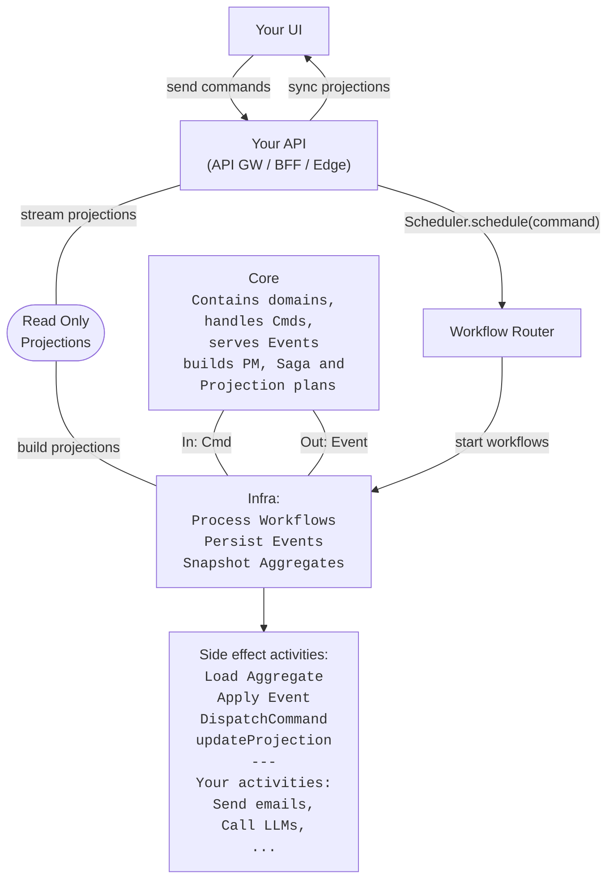

# Project Layout and How It All Fits Together

This document explains how the Intent repository is organized and how the architecture is layered.

# Inside the Intent Codebase

The Intent project follows a structured organization that reflects its architectural principles:

```
.
├── ADRs/                       # Architectural decision logs
├── Dockerfile.worker           # Container for Temporal worker
├── README.md                   # Quick-start & high-level overview
├── docker-compose.yml          # Local infra: Postgres, Temporal, Supabase
├── docs/                       # Documentation
├── jest*.config.js             # Unit / integration test configs
├── setup.sh                    # One-shot project bootstrap helper
├── src/                        # Source code
│   ├── core/                   # Domain logic
│   ├── infra/                  # Infrastructure adapters
│   ├── tools/                  # Developer tools
│   ├── server.ts               # Optional HTTP entry-point
│   └── worker.ts               # Temporal worker bootstrap
└── temporal-config/            # Dynamic config for local Temporal
```

## How it is wired

The flowchart below shows how data flows from user actions through command processing, workflows, and projections aka. read model updates.



## Codebase Layers

Intent follows a hexagonal (ports-and-adapters) architecture, which is reflected in its directory structure. The codebase is organized into three main layers:

### 1. Core (Domain Layer) - `src/core/`

The Core layer contains pure business logic, organized around the domain:

- **Aggregates**: Domain entities that encapsulate business rules and state
- **Commands**: Instructions to change the system state
- **Events**: Records of state changes
- **Sagas**: Orchestrators for complex business processes

Key characteristics:
- No dependency on infrastructure
- Replay-safe and testable
- Organized into domain-specific vertical slices (e.g., `system/`, `orders/`)

To see what our aggregate looks like, check out `src/core/system/aggregates/system.aggregate.ts`.

### 2. Infra (Adapter Layer) - `src/infra/`

Infra implements the actual tech, Postgres, Temporal, behind the abstract interfaces defined in Core:

- **PostgreSQL adapters**: Event store and projection implementations
- **Temporal adapters**: Workflow engine integration
- **Authentication adapters**: User authentication and authorization

Key characteristics:
- Adapters plug into the Core layer via explicit ports
- Respects domain boundaries (no core leakage)
- Handles cross-cutting concerns like multi-tenancy and security

### 3. Tools Layer - `src/tools/`

The Tools layer provides developer utilities and CI/CD helpers:

- **Setup tools**: For initializing the event store, running migrations, etc.
- **Drift repair**: For detecting and fixing projection schema drift
- **Linting tools**: For enforcing RLS policies and other security measures
- **DevX helpers**: CLI and UI tools for developer experience

Key characteristics:
- Tied into CI for consistency enforcement
- Provides automation for common development tasks
- Ensures security and correctness of the codebase

## Multi-Tenancy and Security

Multi-tenancy and security are cross-cutting concerns that span all layers of the architecture:

- **Tenant ID**: Present in all commands, events, and database tables
- **Row-Level Security (RLS)**: Enforced at the database level to ensure tenant isolation
- **Access Control**: Every projection defines its own access rules, enforced at the DB level via RLS and CI linting.

## Key Directories in Detail

### `src/core/`

- `src/core/base/aggregate.ts`: Base aggregate class and registry
- `src/core/contracts.ts`: Core interfaces for commands, events, etc.
- `src/core/command-bus.ts`: Command routing and handling
- `src/core/event-bus.ts`: Event routing and handling
- `src/core/*/read-models/`: Projection definitions for each domain

### `src/infra/`

- `src/infra/pg/`: PostgreSQL event store and projection implementations
- `src/infra/temporal/`: Temporal workflow and activity implementations
- `src/infra/integration-tests/`: End-to-end tests for the system
- `src/infra/memory/`: In-memory implementations for testing
- `src/infra/observability/`: Tracing and logging implementations

### `src/tools/`

- `src/tools/setup/`: Interactive setup CLI
- `src/tools/projection-drift/`: Tools for detecting and fixing schema drift
- `src/tools/policy-linter/`: Tools for enforcing RLS policies

## Hexagonal Architecture Benefits

The hexagonal architecture provides several benefits:

1. **Testability**: Core logic can be tested in isolation without infrastructure dependencies
2. **Flexibility**: Infrastructure implementations can be swapped without changing core logic
3. **Clarity**: Clear separation of concerns makes the codebase easier to understand
4. **Evolution**: The system can evolve over time without breaking existing functionality

By maintaining this separation, Intent ensures that business logic remains pure and infrastructure concerns don't leak into the domain model.