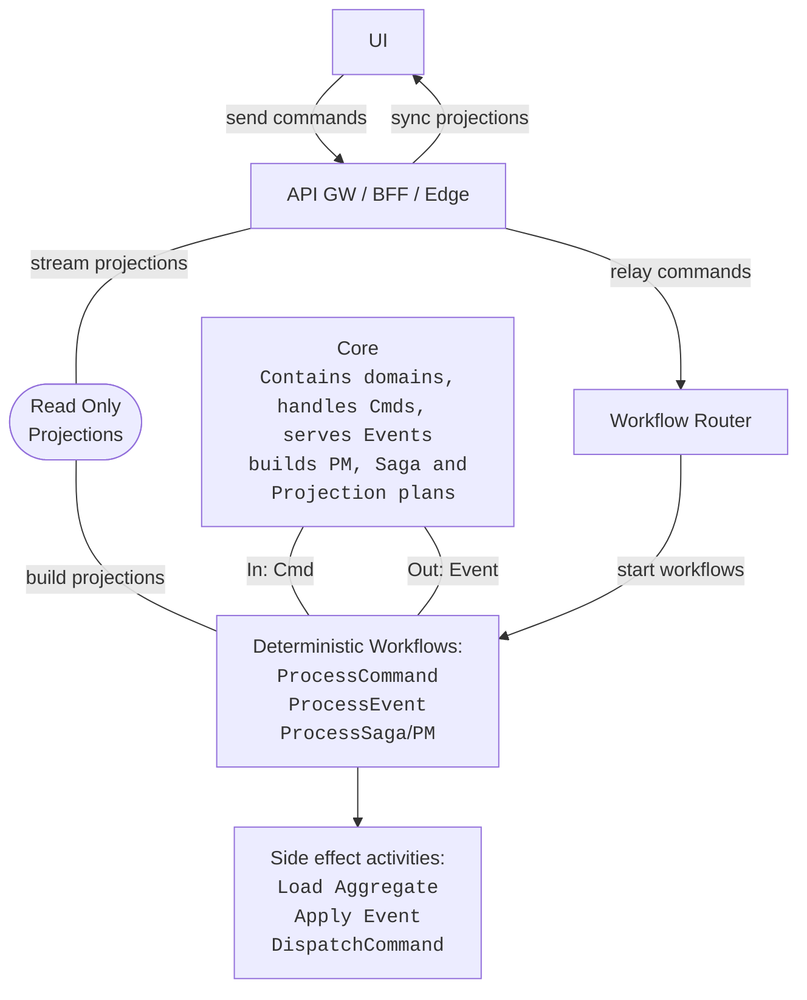

```mermaid
flowchart TB
  UI["UI"]
  APIGW["API GW / BFF / Edge"]
  Projections(["Read Only<br>Projections"])
  Core["Core<br><code>Contains domains,<br/>handles Cmds, serves Events<br>builds PM, Saga and<br/> Projection plans</code>"]
  Workflow["Deterministic Workflows:<br><code>ProcessCommand</code><br><code>ProcessEvent</code><br><code>ProcessSaga</code>/<code>PM</code>"]
  Router["Workflow Router"]
  Activities["Side effect activities:<br><code>Load Aggregate</code><br><code>Apply Event</code><br><code>DispatchCommand</code>"]

  APIGW -->|sync projections| UI
  UI -->|send commands| APIGW
  APIGW -->|relay commands| Router
  APIGW ---|stream projections| Projections

  Projections ---|build projections| Workflow
  Core ---|In: Cmd| Workflow
  Core ---|Out: Event| Workflow
  Router -->|start workflows| Workflow

  Workflow --> Activities

%% click Core href "src/core" "Core"
%% click Projections href "src/infra/projections" "Projections"
%% click Workflows href "src/infra/temporal/workflows" "Workflows"
```